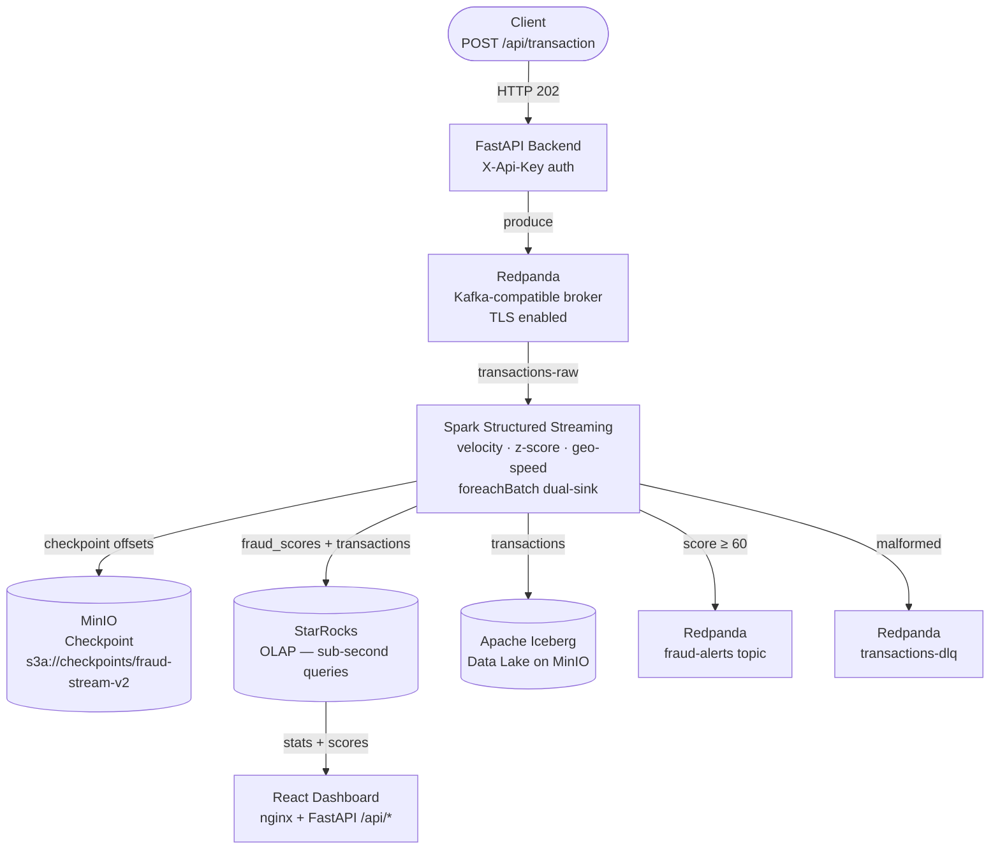

# Huanca — Real-Time Payment Fraud Detection System

End-to-end streaming fraud detection pipeline built on Kubernetes. Transactions are ingested via REST, scored in real time using velocity, statistical, and geospatial signals, persisted to an OLAP store for sub-second querying, and surfaced on a live dashboard — all running on a single-node K8s cluster to demonstrate production engineering patterns at minimal infrastructure cost.

---

## Architecture



---

## Stack

| Component | Technology | Version |
|-----------|-----------|---------|
| Message broker | Redpanda (Kafka-compatible) | Operator v2 |
| Stream processing | Apache Spark Structured Streaming | 3.5.6 |
| OLAP store | StarRocks | 3.2.11 |
| Data lake | Apache Iceberg on MinIO | 1.5.2 |
| Object storage | MinIO | latest |
| Orchestration | Apache Airflow | Helm chart |
| GitOps | ArgoCD | — |
| In-cluster builds | BuildKit | — |
| Infrastructure | Terraform (K8s RBAC + ServiceAccounts) | ≥ 1.5 |
| Backend API | FastAPI + confluent-kafka | Python 3.12 |
| Dashboard | React 18 + Recharts + nginx | — |
| Platform | Kubernetes (Hetzner Cloud) | — |

---

## Fraud Scoring

The pipeline runs three independent signal checks per transaction inside a `foreachBatch` handler:

| Signal | Method | Score Contribution |
|--------|--------|--------------------|
| Velocity | `flatMapGroupsWithState` — rolling 5-min transaction count per user | +40 pts if > threshold |
| Amount anomaly | Z-score against per-user running mean/stddev from StarRocks | +30 pts if z > 3.0 |
| Geo-speed | Haversine distance between consecutive transactions ÷ elapsed time | +30 pts if > 500 km/h |

Final `fraud_score` ∈ [0, 100]. Transactions scoring ≥ 60 are written to the `fraud-alerts` Redpanda topic and the `fraud.fraud_scores` StarRocks table. All thresholds are environment-variable driven — no hardcoded values.

---

## Data Flow

```
transactions-raw  →  Spark (score)  →  StarRocks fraud.transactions
                                    →  StarRocks fraud.fraud_scores
                                    →  Iceberg fraud.transactions (data lake)
                                    →  Redpanda fraud-alerts (downstream consumers)
                                    →  Redpanda transactions-clean (validated records)
                                    →  Redpanda transactions-dlq (malformed records)
```

---

## Key Engineering Decisions

**Stateful velocity without watermarks**
`flatMapGroupsWithState` with `ProcessingTimeTimeout` rather than watermark-based aggregation. Watermarks deflate velocity counts on delayed data — processing-time state avoids this for a fraud signal that must react to wall-clock rate.

**Dual-sink writes in a single foreachBatch**
StarRocks (hot path, sub-second query latency) and Iceberg (cold path, compaction-friendly columnar storage) are written atomically in the same micro-batch. A failure in either rolls back the batch via checkpoint — no partial writes.

**Checkpoint fault tolerance**
Kafka offsets and operator state are checkpointed to `s3a://checkpoints/fraud-stream-v2` on MinIO. On pod restart the stream resumes from the last committed offset — zero data loss, no reprocessing configuration needed.

**No `kafka.group.id`**
Spark Structured Streaming manages its own offset tracking via the checkpoint. Injecting an explicit consumer group causes offset conflicts on restart — the field is intentionally absent.

**In-cluster image builds**
BuildKit runs as a Deployment inside the cluster. A K8s Job renders a `buildkit-job.yaml.tpl` via `envsubst`, builds the Docker image, and pushes to GHCR — no local Docker daemon, no CI runner dependency. Every image is tagged with the exact git SHA of the commit that triggered it.

**SHA integrity chain**
`git commit → GIT_SHA → BuildKit job → image:SHA → envsubst → SparkApplication manifest → running pod`. Every link in the chain carries the same SHA. Rendered manifests are gitignored — the `.tpl` files are the source of truth.

**Iceberg JDBC catalog**
Iceberg catalog state is stored in PostgreSQL (the Airflow DB) via the JDBC catalog provider — no Hive Metastore dependency, no extra stateful service.

**API key injection at nginx**
The React dashboard calls the FastAPI backend through an nginx proxy (`/api` prefix). The API key is injected at nginx via `envsubst` into `proxy_set_header X-Api-Key` — the browser never sees the key.

---

## Airflow DAGs

| DAG | Schedule | Purpose |
|-----|----------|---------|
| `fraud_hourly_reconcile` | Hourly | Compares Redpanda consumer lag vs StarRocks row count — alerts on pipeline drift |
| `fraud_daily_customer_refresh` | 02:00 daily | Loads customer enrichment CSV from ConfigMap into Iceberg `fraud.customers` |
| `fraud_feature_refresh` | Configurable | Refreshes risk profile cache used by the geo-speed UDF |

DAGs are loaded via `git-sync` from this repo — no DAG files baked into the Airflow image.

---

## Backend API

```
GET  /api/health              — liveness probe, no auth
POST /api/transaction         — produce transaction to Redpanda (202 Accepted)
GET  /api/stats               — aggregate metrics for the last hour from StarRocks
GET  /api/fraud-scores        — recent flagged transactions (default limit 20)
GET  /api/top-risky-users     — users with highest flag count over 24h
```

All routes except `/api/health` require `X-Api-Key` header.

---

## Infrastructure (Terraform)

Terraform runs inside a K8s Job (not locally) and manages only RBAC and ServiceAccounts — it never creates namespaces. State is stored in MinIO (`s3a://tf-state/fraud-lab/terraform.tfstate`). Credentials are injected from K8s secrets at job runtime — never hardcoded, never in `.tfvars` committed to git.

---

## GitOps (ArgoCD)

The `gitops/bigdata/` tree is managed by ArgoCD. Redpanda cluster, StarRocks, MinIO jobs, and Airflow values are all declared as ArgoCD Applications — `kubectl apply` is only used for resources that depend on runtime secrets not available at ArgoCD sync time (the SparkApplication manifest, which requires the Iceberg DB password injected from the Airflow PostgreSQL secret).

---

## Repository Structure

```
Huanca/
├── spark-jobs/                    # Spark application code
│   ├── fraud_stream_to_starrocks.py   # Main streaming job
│   ├── customer_csv_to_iceberg.py
│   ├── init_iceberg_schema.py
│   └── compact_iceberg.py
├── k8s-bigdata/spark-fraud-job/   # Spark image Dockerfile + manifest templates
├── k8s-apps/
│   ├── backend-api/               # FastAPI backend + BuildKit template
│   └── fraud-ui/                  # React dashboard + nginx + BuildKit template
├── dags/                          # Airflow DAGs
├── gitops/                        # ArgoCD-managed manifests
│   ├── bigdata/                   # Redpanda, StarRocks, MinIO, Airflow, BuildKit
│   └── argocd/                    # ArgoCD Application definitions
└── infra/terraform/               # RBAC, ServiceAccounts
```

---

## Security Posture

- All pods run as non-root (`runAsNonRoot: true`), numeric UID enforced at K8s admission
- Secrets injected exclusively via K8s Secrets — no environment files, no `.tfvars` in git
- Redpanda inter-broker and client TLS enabled
- RBAC follows least-privilege: each ServiceAccount (Spark, Airflow, BuildKit) has its own ClusterRole scoped to required resources only
- API key never exposed to the browser — injected at nginx proxy layer
