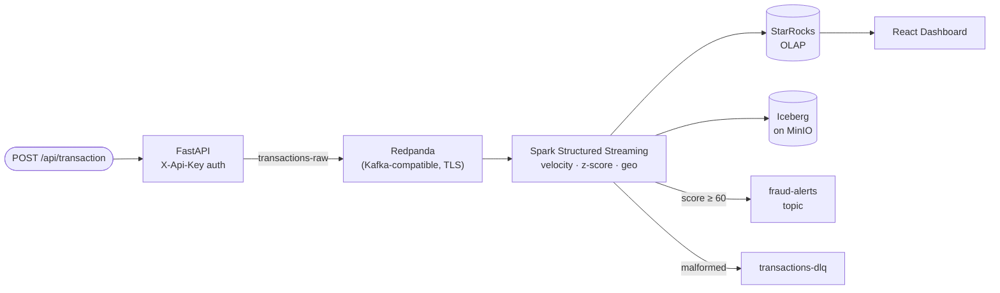

# Huanca — Real-Time Payment Fraud Detection

An end-to-end fraud detection pipeline running on Kubernetes. REST endpoint accepts transactions, Spark scores them in real time against velocity, statistical, and geospatial signals, results land in StarRocks for sub-second querying, and a live dashboard shows what's happening now.

**Live dashboard:** http://95.217.112.184

---

## How it works



The backend produces to Redpanda and returns 202 only after the broker acknowledges — no fire-and-forget. Redpanda over Kafka: same wire protocol, significantly less operational overhead, and no ZooKeeper. Anything downstream that speaks Kafka speaks Redpanda without modification.

Spark consumes `transactions-raw` in 10-second micro-batches. All scoring and sink writes happen inside `foreachBatch` — this matters because it lets StarRocks and Iceberg be written in the same atomic step. If either write fails, the checkpoint doesn't advance and the batch replays cleanly. The alternative (separate streaming queries per sink) would let one sink advance while the other fails, producing divergence that's painful to detect and painful to fix.

The hot/cold split between StarRocks and Iceberg is intentional. StarRocks handles sub-second aggregations over recent data — the dashboard never waits. Iceberg handles everything else: historical queries, backfills, future model training. Both stores receive every transaction from the same batch, so they're never out of sync.

Flagged transactions are also published to `fraud-alerts` — a downstream hook for case management, alerting, or model retraining without touching the scoring pipeline. Malformed records go to `transactions-dlq`, not `/dev/null`.

Each transaction gets three independent scores combined into a single `fraud_score` [0–100]:

| Signal | Approach | Weight |
|--------|----------|--------|
| Velocity | `flatMapGroupsWithState` — rolling 5-min tx count per user | 40 pts |
| Amount anomaly | Z-score vs per-user running mean/stddev (from StarRocks) | 30 pts |
| Geo-speed | Haversine distance ÷ elapsed time between consecutive transactions | 30 pts |

Transactions scoring ≥ 60 are flagged. All thresholds are env-var driven.

---

## Stack

| Layer | Technology | Version |
|-------|-----------|---------|
| Broker | Redpanda (Kafka API) | Operator v2 |
| Streaming | Apache Spark Structured Streaming | 3.5.6 |
| OLAP | StarRocks | 3.2.11 |
| Data lake | Apache Iceberg on MinIO | 1.5.2 |
| Orchestration | Apache Airflow | Helm |
| GitOps | ArgoCD | — |
| Builds | BuildKit (in-cluster) | — |
| Infra | Terraform | ≥ 1.5 |
| Backend | FastAPI + confluent-kafka | Python 3.12 |
| UI | React 18 + Recharts + nginx | — |
| Platform | Kubernetes on Hetzner Cloud | — |

---

## Design decisions

**Velocity uses processing-time state, not watermarks.** Watermark-based aggregation deflates counts when data arrives late — for a fraud velocity signal you want wall-clock rate, not event-time bucketing. `flatMapGroupsWithState` with `ProcessingTimeTimeout` gives you that.

**Both sinks write in the same `foreachBatch` call.** StarRocks (hot path) and Iceberg (cold path, compaction-friendly) are written in the same micro-batch. If either fails the checkpoint doesn't advance — no partial writes, no reconciliation headaches.

**No `kafka.group.id` in the Spark config.** Spark manages its own offset tracking through the checkpoint. Adding an explicit consumer group creates a second offset cursor in Redpanda that diverges from the checkpoint on restart — silent data loss or reprocessing. The field is intentionally absent.

**Builds happen inside the cluster.** BuildKit runs as a K8s Deployment. A Job renders the build manifest with `envsubst` (injecting `$GIT_SHA`), builds the image, pushes to GHCR. No local Docker, no external CI. Every image tag is the exact git SHA that produced it — `git commit → image:SHA → SparkApplication manifest → running pod`.

**Iceberg uses a JDBC catalog backed by PostgreSQL.** No Hive Metastore. The Airflow PostgreSQL instance doubles as the catalog store via the Iceberg JDBC provider — one less stateful service to operate.

**The API key never touches the browser.** The React app talks to the backend through an nginx proxy. `envsubst` injects the key into `proxy_set_header X-Api-Key` at container startup — the browser only ever sees the nginx address.

---

## Airflow DAGs

Three DAGs run on schedule:

- **`fraud_hourly_reconcile`** — compares Redpanda consumer lag against StarRocks row counts every hour. Catches pipeline drift before it becomes a data quality incident.
- **`fraud_daily_customer_refresh`** — loads customer enrichment data from a K8s ConfigMap into Iceberg `fraud.customers` at 02:00.
- **`fraud_feature_refresh`** — refreshes the risk profile cache used by the geo-speed UDF.

DAGs sync from this repo via `git-sync` — nothing baked into the Airflow image.

---

## Dashboard

Live at **http://95.217.112.184** — auto-refreshes every 5 seconds.

Shows real-time metrics over the last hour: total transactions, flagged count, average fraud score, flag rate, a bar chart of recent fraud scores, top risky users over 24h, and a table of the most recent fraud alerts with score breakdown and reasons.

The dashboard talks to the FastAPI backend through an nginx proxy. The API key is injected at the nginx layer — it never touches the browser.

---

## API

```
GET  /api/health              no auth — liveness probe
POST /api/transaction         produce to Redpanda, returns 202
GET  /api/stats               1h aggregates from StarRocks
GET  /api/fraud-scores        recent flagged transactions
GET  /api/top-risky-users     highest-flag-count users over 24h
```

---

## Infrastructure

Terraform runs inside a K8s Job — not from a laptop. It manages RBAC and ServiceAccounts only; namespaces are pre-existing. State lives in MinIO at `s3a://tf-state/fraud-lab/terraform.tfstate`. No credentials in `.tfvars`, no credentials in git.

ArgoCD manages everything under `gitops/bigdata/` — Redpanda, StarRocks, MinIO, Airflow. The SparkApplication is applied imperatively because it depends on a runtime secret (Iceberg DB password from the Airflow PostgreSQL secret) that isn't available at ArgoCD sync time.

---

## Repo layout

```
Huanca/
├── spark-jobs/                     # Spark application code
│   └── fraud_stream_to_starrocks.py    # main streaming job
├── k8s-bigdata/spark-fraud-job/    # Dockerfile + manifest templates
├── k8s-apps/
│   ├── backend-api/                # FastAPI backend
│   └── fraud-ui/                   # React + nginx
├── dags/                           # Airflow DAGs
├── gitops/                         # ArgoCD-managed manifests
└── infra/terraform/                # RBAC, ServiceAccounts
```
