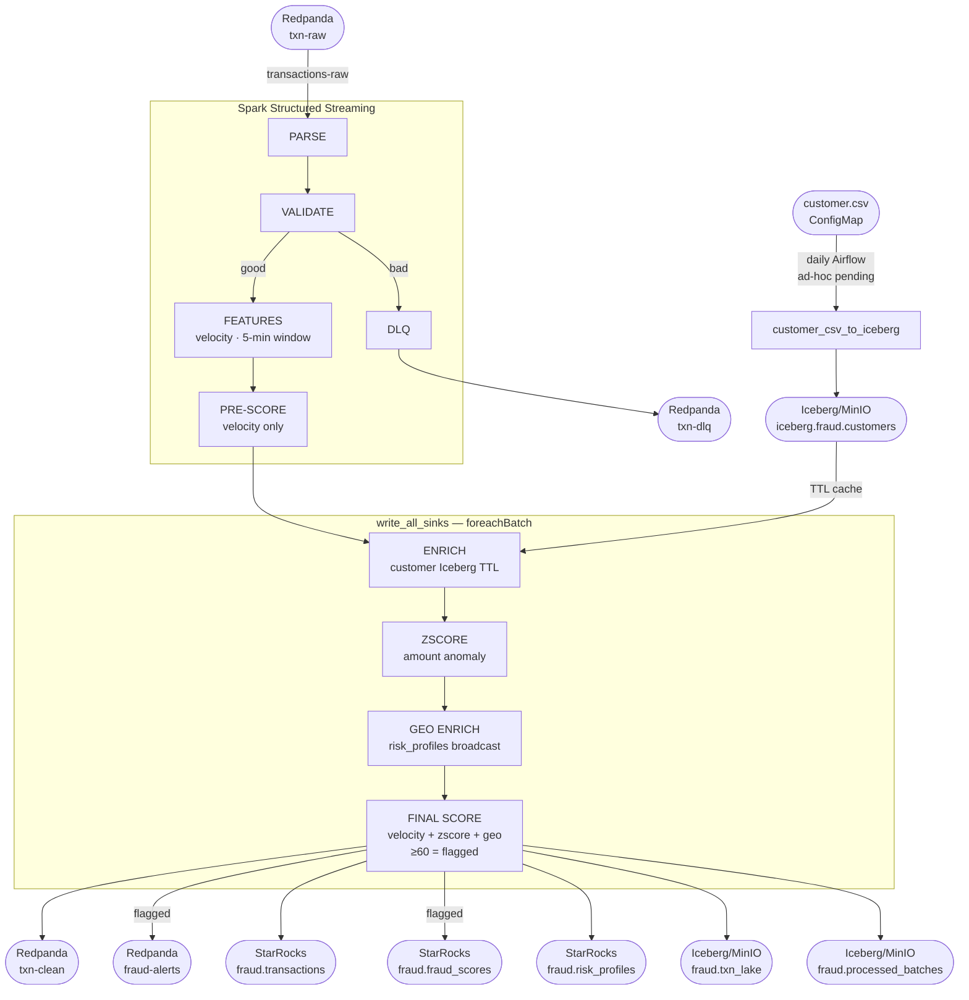

# Real-Time Payment Fraud Detection Pipeline
## Complete Lab — kubeadm Kubernetes | Production-Style | 2026 Stack
### Repo: Huanca | Cluster: Hetzner | Registry: ghcr.io/jjcorderomejia

---

## V9 

--

## STACK OVERVIEW

| Layer | Technology | Replaces |
|---|---|---|
| Streaming | Redpanda | Kafka + Strimzi |
| Compute | Spark Structured Streaming (Spark Operator) | unchanged |
| Real-time sink | StarRocks | Cassandra |
| Object storage | MinIO | HDFS |
| Table format | Apache Iceberg (JDBC catalog on PostgreSQL) | Hive Metastore |
| Orchestration | Airflow (K8sExecutor) | none |
| Build engine | BuildKit | Kaniko (archived) |
| GitOps | ArgoCD | none |
| IaC baseline | Terraform (runs as K8s Job) | none |
| UI | React + Nginx | Tomcat JSP |
| Backend API | FastAPI | unchanged |

---

## GROUND RULES (READ BEFORE ANYTHING)

```
ENGINEERING DISCIPLINE:
1.  Every shell script starts with: set -euo pipefail
2.  Every image is tagged with GIT_SHA — :latest is NEVER used
3.  Every PVC explicitly sets storageClassName: local-path
4.  SparkApplication is NEVER managed by ArgoCD — always imperative
5.  BuildKit Jobs are one-shot per GIT_SHA — never reused
6.  Terraform state lives in MinIO — never on local disk
7.  Spark checkpoints go to MinIO — never to a ReadWriteOnce PVC
8.  All manifests use .yaml.tpl + envsubst → _rendered/ pattern
9.  UUID4 for all IDs — $RANDOM is banned
10. Git authentication via SSH key only — no plaintext tokens ever

SECURITY (NON-NEGOTIABLE):
11. Zero plaintext credentials in any YAML, Python, or Terraform file
12. All credentials live in Kubernetes Secrets — auto-generated via openssl rand (preferred) or read -s for external tokens (e.g. GHCR PAT)
13. All credentials mounted as env vars from K8s Secrets — never hardcoded
14. No default passwords — every service gets a strong password on first boot
15. No empty passwords — StarRocks, MinIO, all services require real auth
16. sensitive=true on all Terraform credential variables
17. .gitignore covers: _rendered/, *.tfstate, *.tfvars, .env, *secret* files

VALIDATION (NON-NEGOTIABLE):
18. kubectl port-forward is NEVER used as a validation step in this lab
19. Internal services validated via ClusterIP curl from the kubeadm host
20. User-facing services validated via Ingress + public IP
```

---

## NAMESPACE MAP

```
bigdata/        infra + compute (Redpanda, StarRocks, MinIO, Spark, Airflow)
apps/           user-facing (FastAPI, React UI, Ingress)
argocd/         GitOps controller
spark-operator/ Spark Operator controller
ingress-nginx/  Ingress controller (existing)
```

---

## REPO STRUCTURE (Huanca)


```
Huanca/
  infra/terraform/
    main.tf
    variables.tf
    outputs.tf
    backend.tf

  gitops/
    argocd/
      app-bigdata.yaml
    bigdata/
      redpanda/
        cluster.yaml
        topics-fraud.yaml
      starrocks/
        starrocks.yaml
        init-ddl-job.yaml
      minio/
        minio.yaml
      airflow/
        airflow.yaml
      enrichment/
        customer-csv-configmap.yaml

  k8s-apps/
    backend-api/
      Dockerfile
      buildkit-job.yaml.tpl
      backend-api.yaml.tpl
    fraud-ui/
      Dockerfile
      buildkit-job.yaml.tpl
      fraud-ui.yaml.tpl
    apps-ingress-ui.yaml
    apps-ingress-backend.yaml

  k8s-bigdata/
    spark-fraud-job/
      Dockerfile
      buildkit-job.yaml.tpl
      spark-fraud-stream.yaml.tpl
      _rendered/
    _render_spark_ver/
      spark_base_image.env

  spark-jobs/
    fraud_stream_to_starrocks.py
    customer_csv_to_iceberg.py
    compact_iceberg.py

  docs/
    queries.md
    semantics.md
    system_design.md
    interview_talk_track.md
```

---

## 00-A) PER-SHELL ENV (run every login)

```bash

cat > ~/.lab_Huanca  <<'EOF'
set -euo pipefail

export REGISTRY=ghcr.io
export ORG=jjcorderomejia
export IMAGE_NS=$REGISTRY/$ORG
export API_SERVER=https://95.217.112.184:6443
export SPARK_MASTER=k8s://https://95.217.112.184:6443

export REPO_ROOT=/home/jjcm/Huanca
export BD_ROOT=$REPO_ROOT/k8s-bigdata
export APPS_ROOT=$REPO_ROOT/k8s-apps

# GIT_SHA from repo
export GIT_SHA=$(git -C $REPO_ROOT rev-parse --short HEAD)
echo "GIT_SHA=${GIT_SHA}"

# Namespaces
export NS_BIG=bigdata
export NS_APP=apps
EOF

```


---

## 00-B: GITHUB SSH SETUP + REPO INITIALIZATION
## (Run once — before anything else in this lab)

> Prod standard: zero plaintext tokens. SSH key authentication only.
> Never run: git remote set-url origin https://YOUR_TOKEN@github.com/...

### Step 1 — Generate SSH key on Hetzner

```bash
ssh-keygen -t ed25519 -C "hetzner-huanca" -f ~/.ssh/github_huanca -N ""
cat ~/.ssh/github_huanca.pub
```

Copy the full output — you paste it into GitHub in the next step.

### Step 2 — Add public key to GitHub

```
1. Open: https://github.com/settings/ssh/new
2. Title: hetzner-huanca
3. Key:   paste the output from Step 1
4. Click: Add SSH key
```

### Step 3 — Configure SSH on Hetzner

```bash
cat >> ~/.ssh/config <<'EOF'
Host github.com
  IdentityFile ~/.ssh/github_huanca
  User git
EOF
chmod 600 ~/.ssh/config
```

### Step 4 — Test SSH authentication

```bash
ssh -T git@github.com
# Expected: Hi jjcorderomejia! You've successfully authenticated
```

Do not proceed until you see that message.

### Step 5 — Initialize Huanca repo + first commit

```bash
set -euo pipefail

# Git identity (one-time global config)
git config --global user.email "jjcorderomejia@yahoo.com"
git config --global user.name "jjcorderomejia"

# Create full repo folder structure
mkdir -p ~/Huanca/{infra/terraform,gitops/{argocd,bigdata/{redpanda,starrocks,minio,airflow,enrichment}},k8s-apps/{backend-api,fraud-ui},k8s-bigdata/spark-fraud-job/_rendered,spark-jobs,docs}

# .gitignore — never commit rendered manifests, state files, or secrets
cat > ~/Huanca/.gitignore <<'EOF'
# Rendered manifests (contain image SHAs — never commit)
**/_rendered/

# Terraform state (lives in MinIO — never local)
**/*.tfstate
**/*.tfstate.backup
**/.terraform/
**/*.tfvars

# Secrets and env files
.env
*.env
*secret*
*credentials*

# Python
__pycache__/
*.pyc
*.pyo
EOF

# README placeholder
cat > ~/Huanca/README.md <<'EOF'
# Huanca — Real-Time Payment Fraud Detection Pipeline

Kubernetes-native fraud detection lab.

Stack: Redpanda | Spark Structured Streaming | StarRocks | Apache Iceberg | MinIO | Airflow | ArgoCD | BuildKit

> Lab in progress
EOF

cd ~/Huanca
git init
git branch -M main
git remote add origin git@github.com:jjcorderomejia/Huanca.git

git add .
git commit -m "Initial commit — Huanca fraud detection lab structure"
git push -u origin main

echo "✅ Repo live: https://github.com/jjcorderomejia/Huanca"
```

---

## 00-C: CLEAN RESET (run if cluster state is dirty)

```bash
#!/bin/bash
set -euo pipefail

for NS in bigdata apps argocd; do
  echo "🧹 Resetting namespace: ${NS}"
  kubectl -n "${NS}" delete deploy,sts,ds,rs,po,svc,ing,job,cronjob \
    --all --ignore-not-found
  kubectl -n "${NS}" delete cm,secret,sa,role,rolebinding \
    --all --ignore-not-found
  kubectl -n "${NS}" delete pvc --all --ignore-not-found
  kubectl delete ns "${NS}" --ignore-not-found
  echo "✅ Done: ${NS}"
done
```


---

## ════════════════════════════════════════
## PHASE 0 — TERRAFORM BASELINE
## ════════════════════════════════════════

> Provisions: namespaces, ServiceAccounts, RBAC, GHCR pull secrets.
> State lives in MinIO (bootstrapped below).
> Terraform runs as a K8s Job — cluster DNS resolves naturally.
> Safe to re-run (terraform apply is idempotent).

### 0.1 Install Terraform on host (optional — for debugging only)

```bash
# Terraform runs as a K8s Job, but having it on the host is useful for
# terraform output, terraform state list, etc.
sudo apt-get update -y
sudo apt-get install -y gnupg software-properties-common curl

curl -fsSL https://apt.releases.hashicorp.com/gpg \
  | gpg --dearmor \
  | sudo tee /usr/share/keyrings/hashicorp-archive-keyring.gpg >/dev/null

echo "deb [arch=$(dpkg --print-architecture) \
  signed-by=/usr/share/keyrings/hashicorp-archive-keyring.gpg] \
  https://apt.releases.hashicorp.com \
  $(. /etc/os-release && echo ${UBUNTU_CODENAME:-$VERSION_CODENAME}) main" \
  | sudo tee /etc/apt/sources.list.d/hashicorp.list >/dev/null

sudo apt-get update -y
sudo apt-get install -y terraform

terraform -version
```

### 0.2 MinIO — Already Running (SKIP DEPLOYMENT)

> MinIO is already deployed in the `bigdata` namespace from the Cassandra lab.
> StatefulSet: `minio` | Secret: `minio-secret` | Keys: `MINIO_ROOT_USER` / `MINIO_ROOT_PASSWORD`
> All fraud lab manifests reference `minio-secret` directly — no alias secret needed.

```bash
# Verify MinIO is healthy before continuing
kubectl -n bigdata get pods -l app=minio
kubectl -n bigdata get statefulset minio
echo "✅ MinIO running — proceed to 0.3"
```

### 0.3 Create MinIO buckets (idempotent via mc)

> Creates fraud lab buckets on the existing MinIO instance.
> Credentials sourced directly from `minio-secret` (keys: MINIO_ROOT_USER / MINIO_ROOT_PASSWORD).

```bash
kubectl -n bigdata run mc-setup --rm -it --restart=Never \
  --image=quay.io/minio/mc:RELEASE.2024-06-12T14-34-03Z \
  --env="MINIO_USER=$(kubectl -n bigdata get secret minio-secret \
    -o jsonpath='{.data.MINIO_ROOT_USER}' | base64 -d)" \
  --env="MINIO_PASS=$(kubectl -n bigdata get secret minio-secret \
    -o jsonpath='{.data.MINIO_ROOT_PASSWORD}' | base64 -d)" \
  --command -- bash -lc '
    set -euo pipefail
    mc alias set local http://minio:9000 "${MINIO_USER}" "${MINIO_PASS}"

    # Create buckets (idempotent — safe to re-run)
    for bucket in iceberg tf-state checkpoints airflow; do
      mc mb --ignore-existing local/$bucket
      echo "✅ bucket: $bucket"
    done

    mc ls local
  '

# Commit
cd $REPO_ROOT
export GIT_SHA=$(git -C $REPO_ROOT rev-parse --short HEAD)
git add .
git commit -m "phase-0.3: MinIO fraud lab buckets created"
git push origin main  
```

### 0.4 Write Terraform files

| File | Purpose |
|---|---|
| `backend.tf` | Where Terraform stores state (MinIO `tf-state` bucket) |
| `variables.tf` | Input parameters — no hardcoded values in resources |
| `main.tf` | The actual infrastructure — what Terraform creates. In this lab: Kubernetes namespaces, RBAC (ServiceAccounts, Roles, RoleBindings), PVCs.  |
| `outputs.tf` | What Terraform prints after apply — values used in later phases |

```bash
mkdir -p $REPO_ROOT/infra/terraform
```

#### `infra/terraform/backend.tf`

```bash
# FIX 1+2: Terraform runs as a K8s Job — endpoint uses cluster DNS.
# FIX 2: Uses current endpoints {} block + use_path_style (not deprecated endpoint/force_path_style).
cat > $REPO_ROOT/infra/terraform/backend.tf <<'EOF'
terraform {
  backend "s3" {
    bucket                      = "tf-state"
    key                         = "fraud-lab/terraform.tfstate"
    region                      = "us-east-1"
    endpoints                   = { s3 = "http://minio.bigdata.svc.cluster.local:9000" }
    skip_credentials_validation = true
    skip_metadata_api_check     = true
    skip_requesting_account_id  = true
    use_path_style              = true
    # Credentials passed via AWS_ACCESS_KEY_ID / AWS_SECRET_ACCESS_KEY env vars
    # Never hardcoded here — injected from minio-secret in K8s Job
  }
}
EOF
```

#### `infra/terraform/variables.tf`

```bash
cat > $REPO_ROOT/infra/terraform/variables.tf <<'EOF'
variable "ghcr_token" {
  type      = string
  sensitive = true
}

variable "ghcr_user" {
  type    = string
  default = "jjcorderomejia"
}

variable "bigdata_namespace" {
  type    = string
  default = "bigdata"
}

variable "apps_namespace" {
  type    = string
  default = "apps"
}
EOF
```

#### `infra/terraform/main.tf`

```bash
cat > $REPO_ROOT/infra/terraform/main.tf <<'EOF'
terraform {
  required_version = ">= 1.5.0"
  required_providers {
    kubernetes = {
      source  = "hashicorp/kubernetes"
      version = ">= 2.20.0"
    }
  }
}

provider "kubernetes" {}

# ── Namespaces (all pre-existing — Terraform reads only) ─────────────
data "kubernetes_namespace" "bigdata" {
  metadata { name = var.bigdata_namespace }
}

data "kubernetes_namespace" "apps" {
  metadata { name = var.apps_namespace }
}

data "kubernetes_namespace" "argocd" {
  metadata { name = "argocd" }
}

data "kubernetes_namespace" "spark_operator" {
  metadata { name = "spark-operator" }
}

# ── Existing secrets — read only ────────────────────────────────────
data "kubernetes_secret" "ghcr_bigdata" {
  metadata {
    name      = "ghcr-creds"
    namespace = "bigdata"
  }
}

data "kubernetes_secret" "ghcr_apps" {
  metadata {
    name      = "ghcr-creds"
    namespace = "apps"
  }
}

# ── Spark ServiceAccount + RBAC ─────────────────────────────────────
data "kubernetes_service_account" "spark" {
  metadata {
    name      = "spark"
    namespace = "bigdata"
  }
}

resource "kubernetes_cluster_role" "spark_role" {
  metadata { name = "spark-role" }
  rule {
    api_groups = [""]
    resources  = ["pods", "pods/log", "services", "configmaps", "secrets",
                  "persistentvolumeclaims"]
    verbs      = ["get", "list", "watch", "create", "delete", "patch", "update"]
  }
  rule {
    api_groups = ["sparkoperator.k8s.io"]
    resources  = ["sparkapplications", "scheduledsparkapplications"]
    verbs      = ["get", "list", "watch", "create", "delete", "patch", "update"]
  }
}

resource "kubernetes_cluster_role_binding" "spark_binding" {
  metadata { name = "spark-role-binding" }
  role_ref {
    api_group = "rbac.authorization.k8s.io"
    kind      = "ClusterRole"
    name      = kubernetes_cluster_role.spark_role.metadata[0].name
  }
  subject {
    kind      = "ServiceAccount"
    name      = data.kubernetes_service_account.spark.metadata[0].name
    namespace = data.kubernetes_namespace.bigdata.metadata[0].name
  }
}

# ── BuildKit ServiceAccount + RBAC ──────────────────────────────────
resource "kubernetes_service_account" "buildkit" {
  metadata {
    name      = "buildkit"
    namespace = data.kubernetes_namespace.bigdata.metadata[0].name
  }
}

resource "kubernetes_cluster_role" "buildkit_role" {
  metadata { name = "buildkit-role" }
  rule {
    api_groups = [""]
    resources  = ["pods", "pods/log"]
    verbs      = ["get", "list", "watch", "create", "delete"]
  }
}

resource "kubernetes_cluster_role_binding" "buildkit_binding" {
  metadata { name = "buildkit-role-binding" }
  role_ref {
    api_group = "rbac.authorization.k8s.io"
    kind      = "ClusterRole"
    name      = kubernetes_cluster_role.buildkit_role.metadata[0].name
  }
  subject {
    kind      = "ServiceAccount"
    name      = kubernetes_service_account.buildkit.metadata[0].name
    namespace = data.kubernetes_namespace.bigdata.metadata[0].name
  }
}

# ── Airflow ServiceAccount + RBAC ───────────────────────────────────
resource "kubernetes_service_account" "airflow" {
  metadata {
    name      = "airflow"
    namespace = data.kubernetes_namespace.bigdata.metadata[0].name
  }
}

resource "kubernetes_cluster_role" "airflow_role" {
  metadata { name = "airflow-role" }
  rule {
    api_groups = [""]
    resources  = ["pods", "pods/log", "pods/exec"]
    verbs      = ["get", "list", "watch", "create", "delete", "patch"]
  }
}

resource "kubernetes_cluster_role_binding" "airflow_binding" {
  metadata { name = "airflow-role-binding" }
  role_ref {
    api_group = "rbac.authorization.k8s.io"
    kind      = "ClusterRole"
    name      = kubernetes_cluster_role.airflow_role.metadata[0].name
  }
  subject {
    kind      = "ServiceAccount"
    name      = kubernetes_service_account.airflow.metadata[0].name
    namespace = data.kubernetes_namespace.bigdata.metadata[0].name
  }
}
EOF
```

#### `infra/terraform/outputs.tf`

```bash
cat > $REPO_ROOT/infra/terraform/outputs.tf <<'EOF'
output "namespaces" {
  value = [
    data.kubernetes_namespace.bigdata.metadata[0].name,
    data.kubernetes_namespace.apps.metadata[0].name,
    data.kubernetes_namespace.argocd.metadata[0].name,
    data.kubernetes_namespace.spark_operator.metadata[0].name,
  ]
  description = "All namespaces — pre-existing, Terraform reads only"
}
EOF
```

### 0.5 Apply Terraform (as K8s Job)

> FIX 1: Terraform runs inside the cluster as a K8s Job.
> Cluster DNS resolves minio.bigdata.svc.cluster.local naturally.
> Kubernetes provider uses in-cluster ServiceAccount auth — no kubeconfig.
> This is the Atlantis/Spacelift pattern used at FAANG scale.

```bash
set -euo pipefail

# Create Terraform ServiceAccount with cluster-admin
# (needs to create namespaces, ClusterRoles, ClusterRoleBindings)
kubectl apply -f - <<'EOF'
apiVersion: v1
kind: ServiceAccount
metadata:
  name: terraform
  namespace: bigdata
---
apiVersion: rbac.authorization.k8s.io/v1
kind: ClusterRoleBinding
metadata:
  name: terraform-admin
roleRef:
  apiGroup: rbac.authorization.k8s.io
  kind: ClusterRole
  name: cluster-admin
subjects:
  - kind: ServiceAccount
    name: terraform
    namespace: bigdata
EOF

# Store GHCR token in K8s Secret — never in shell history or Job YAML
read -s -p "Enter GHCR token: " GHCR_TOKEN
echo

kubectl -n bigdata create secret generic terraform-vars \
  --from-literal=ghcr-token="${GHCR_TOKEN}" \
  --dry-run=client -o yaml | kubectl apply -f -

unset GHCR_TOKEN

# Run Terraform as a K8s Job
kubectl -n bigdata delete job terraform-apply --ignore-not-found

cat <<JOBEOF | kubectl apply -f -
apiVersion: batch/v1
kind: Job
metadata:
  name: terraform-apply
  namespace: bigdata
spec:
  backoffLimit: 2
  template:
    spec:
      serviceAccountName: terraform
      restartPolicy: Never
      containers:
        - name: terraform
          image: hashicorp/terraform:1.9.8
          workingDir: /terraform
          command: ["sh", "-c"]
          args:
            - |
              set -euo pipefail
              terraform init -reconfigure
              terraform apply -auto-approve
              echo "✅ Terraform apply complete"
              terraform output
          env:
            - name: AWS_ACCESS_KEY_ID
              valueFrom:
                secretKeyRef:
                  name: minio-secret
                  key: MINIO_ROOT_USER
            - name: AWS_SECRET_ACCESS_KEY
              valueFrom:
                secretKeyRef:
                  name: minio-secret
                  key: MINIO_ROOT_PASSWORD
            - name: TF_VAR_ghcr_token
              valueFrom:
                secretKeyRef:
                  name: terraform-vars
                  key: ghcr-token
          volumeMounts:
            - name: tf-files
              mountPath: /terraform
      volumes:
        - name: tf-files
          hostPath:
            path: ${REPO_ROOT}/infra/terraform
            type: Directory
JOBEOF

kubectl -n bigdata wait --for=condition=complete job/terraform-apply --timeout=300s
kubectl -n bigdata logs job/terraform-apply

#troubleshouting in case a terraform pod contains error, Fix tf, then clean the stale state and re-run:
kubectl -n bigdata delete job terraform-apply --ignore-not-found
# Re-run the Job creation block from V9 Phase 0.5

cd $REPO_ROOT
```

### 0.6 Validate Phase 0

```bash
# Namespaces
kubectl get ns | grep -E "bigdata|apps|argocd|spark-operator"

# Service accounts
kubectl -n bigdata get sa | grep -E "spark|buildkit|airflow"

# GHCR secrets
kubectl -n bigdata get secret ghcr-creds -o jsonpath='{.type}{"\n"}'
kubectl -n apps   get secret ghcr-creds -o jsonpath='{.type}{"\n"}'

# MinIO running
kubectl -n bigdata get pods -l app=minio
```

### 0.7 Commit Phase 0 to GitHub

```bash
# Commit
cd $REPO_ROOT
export GIT_SHA=$(git -C $REPO_ROOT rev-parse --short HEAD)
git add .
git commit -m "Phase 0: Terraform baseline (K8s Job) + MinIO bootstrap"
git push origin main  
```

---

## ════════════════════════════════════════
## PHASE 1 — REDPANDA CLUSTER + TOPICS
## ════════════════════════════════════════

> Redpanda is Kafka-compatible. No ZooKeeper. No Strimzi.
> Your existing Spark Kafka connector works with zero changes.

### 1.1 Install Redpanda Operator (idempotent)

```bash
# Add Redpanda helm repo
helm repo add redpanda https://charts.redpanda.com
helm repo update

# Install operator
helm upgrade --install redpanda-operator redpanda/operator \
  --namespace bigdata \
  --version 25.2.1 \
  --set image.repository=docker.io/redpandadata/redpanda-operator \
  --set additionalCmdFlags="{--enable-console=false}" \
  --wait --timeout=300s
```

## ════════════════════════════════════════
## PHASE 1 — REDPANDA CLUSTER + TOPICS
## ════════════════════════════════════════

>  Redpanda is Kafka-compatible. No ZooKeeper. No Strimzi.
>  Existing Spark Kafka connector works with zero changes.

## 1.1 Install Redpanda Operator (idempotent)


```bash

set -euo pipefail

REDPANDA_OPERATOR_VERSION="25.2.1"
CRD_BASE="https://raw.githubusercontent.com/redpanda-data/redpanda-operator/operator/v${REDPANDA_OPERATOR_VERSION}/operator/config/crd/bases"

## Step 1 — Apply all CRDs.
## The redpanda/operator helm chart (v25.x) does NOT bundle CRDs. They must
## be applied from the matching source tag BEFORE the operator starts.
## A version mismatch between CRDs and operator binary causes reconcile failures.
##
## LAB NOTE: CRDs are fetched directly from GitHub at runtime. In a production
## environment, mirror these to an internal artifact store and verify checksums
## before applying.

echo "[1/3] Applying Redpanda CRDs (operator v${REDPANDA_OPERATOR_VERSION})..."

kubectl apply --server-side \
  -f "${CRD_BASE}/cluster.redpanda.com_consoles.yaml" \
  -f "${CRD_BASE}/cluster.redpanda.com_nodepools.yaml" \
  -f "${CRD_BASE}/cluster.redpanda.com_redpandas.yaml" \
  -f "${CRD_BASE}/cluster.redpanda.com_redpandaroles.yaml" \
  -f "${CRD_BASE}/cluster.redpanda.com_schemas.yaml" \
  -f "${CRD_BASE}/cluster.redpanda.com_shadowlinks.yaml" \
  -f "${CRD_BASE}/cluster.redpanda.com_topics.yaml" \
  -f "${CRD_BASE}/cluster.redpanda.com_users.yaml" \
  -f "${CRD_BASE}/redpanda.vectorized.io_clusters.yaml" \
  -f "${CRD_BASE}/redpanda.vectorized.io_consoles.yaml"

## Step 2 — Wait for CRDs to reach Established state.

echo "[2/3] Waiting for CRDs to be Established..."

kubectl wait --for=condition=Established --timeout=60s \
  crd/consoles.cluster.redpanda.com \
  crd/nodepools.cluster.redpanda.com \
  crd/redpandas.cluster.redpanda.com \
  crd/redpandaroles.cluster.redpanda.com \
  crd/schemas.cluster.redpanda.com \
  crd/shadowlinks.cluster.redpanda.com \
  crd/topics.cluster.redpanda.com \
  crd/users.cluster.redpanda.com \
  crd/clusters.redpanda.vectorized.io \
  crd/consoles.redpanda.vectorized.io

## Step 3 — Install (or upgrade) the operator.
##
## --force-update on repo add makes this idempotent regardless of prior state.
##
## `upgrade --install` is the idempotent form: installs on first run,
## upgrades on subsequent runs. Safe to re-run in CI/CD pipelines.
##
## NOTE: do NOT pass additionalCmdFlags="{--enable-console=false}".
## The helm template merges additionalCmdFlags with lower priority than its
## hardcoded defaults — the flag is silently ignored. The Console controller
## is harmless once the Console CRD exists (applied above).

echo "[3/3] Installing Redpanda operator..."

helm repo add redpanda https://charts.redpanda.com --force-update
helm repo update redpanda

helm upgrade --install redpanda-operator redpanda/operator \
  --namespace bigdata \
  --version "${REDPANDA_OPERATOR_VERSION}" \
  --set image.repository=docker.io/redpandadata/redpanda-operator \
  --wait --timeout=300s

## Verify:
kubectl -n bigdata get pods | grep redpanda-operator   # expect 1/1 Running
kubectl -n bigdata logs -l app.kubernetes.io/name=redpanda-operator \
| grep '"level":"error"' | grep -v WARNING            # expect no output


# Troubleshooting for deleting panda installation and runnign pods
kubectl -n bigdata describe pod redpanda-operator-847cdb5f55-rzd75 | grep -A5 "Events\|Failed\|pulling\|image"
kubectl -n bigdata logs redpanda-operator-9598f4f5-69nxl --previous
helm uninstall redpanda-operator -n bigdata
kubectl -n bigdata delete pod -l app.kubernetes.io/name=operator --force --grace-period=0  

kubectl -n bigdata rollout status deploy/redpanda-operator --timeout=180s

# Verify CRDs
kubectl get crd | grep redpanda
```

### 1.2 Deploy Redpanda Cluster

```bash
mkdir -p $REPO_ROOT/gitops/bigdata/redpanda

cat > $REPO_ROOT/gitops/bigdata/redpanda/cluster.yaml <<'EOF'
apiVersion: cluster.redpanda.com/v1alpha2
kind: Redpanda
metadata:
  name: fraud-redpanda
  namespace: bigdata
spec:
  chartRef: {}
  clusterSpec:
    statefulset:
      replicas: 1
    storage:
      persistentVolume:
        enabled: true
        size: 20Gi
        storageClass: local-path
    resources:
      requests:
        cpu: "250m"
        memory: "2Gi"
      limits:
        cpu: "2"
        memory: "2Gi"
    config:
      cluster:
        auto_create_topics_enabled: false
    listeners:
      kafka:
        port: 9092
EOF

kubectl apply -f $REPO_ROOT/gitops/bigdata/redpanda/cluster.yaml

# Wait for Redpanda to be ready
#kubectl -n bigdata wait \
#  --for=condition=ready pod \
#  -l app.kubernetes.io/name=redpanda \
#  --timeout=300s

kubectl -n bigdata wait redpanda/fraud-redpanda \
  --for=condition=Ready \
  --timeout=600s  

kubectl -n bigdata get pods | grep redpanda

#troubleshooting
kubectl -n bigdata logs fraud-redpanda-0 --previous | grep ERROR
kubectl -n bigdata logs fraud-redpanda-console-5998b4fc47-bhn7z
kubectl -n bigdata delete pod -l app.kubernetes.io/name=redpanda --force --grace-period=0
```

### 1.3 Create Fraud Topics

```bash
cat > $REPO_ROOT/gitops/bigdata/redpanda/topics-fraud.yaml <<'EOF'
apiVersion: cluster.redpanda.com/v1alpha2
kind: Topic
metadata:
  name: transactions-raw
  namespace: bigdata
spec:
  kafkaApiSpec:
    brokers:
      - fraud-redpanda-0.fraud-redpanda.bigdata.svc.cluster.local:9092
    tls:
      enabled: true
      caCertSecretRef:
        name: fraud-redpanda-default-root-certificate
        key: ca.crt      
  partitions: 6
  replicationFactor: 1
  additionalConfig:
    retention.ms: "604800000"
    cleanup.policy: "delete"
---
apiVersion: cluster.redpanda.com/v1alpha2
kind: Topic
metadata:
  name: transactions-dlq
  namespace: bigdata
spec:
  kafkaApiSpec:
    brokers:
      - fraud-redpanda-0.fraud-redpanda.bigdata.svc.cluster.local:9092
    tls:
      enabled: true
      caCertSecretRef:
        name: fraud-redpanda-default-root-certificate
        key: ca.crt       
  partitions: 3
  replicationFactor: 1
  additionalConfig:
    retention.ms: "1209600000"
    cleanup.policy: "delete"
---
apiVersion: cluster.redpanda.com/v1alpha2
kind: Topic
metadata:
  name: transactions-clean
  namespace: bigdata
spec:
  kafkaApiSpec:
    brokers:
      - fraud-redpanda-0.fraud-redpanda.bigdata.svc.cluster.local:9092
    tls:
      enabled: true
      caCertSecretRef:
        name: fraud-redpanda-default-root-certificate
        key: ca.crt         
  partitions: 6
  replicationFactor: 1
  additionalConfig:
    retention.ms: "604800000"
    cleanup.policy: "delete"
---
apiVersion: cluster.redpanda.com/v1alpha2
kind: Topic
metadata:
  name: fraud-alerts
  namespace: bigdata
spec:
  kafkaApiSpec:
    brokers:
      - fraud-redpanda-0.fraud-redpanda.bigdata.svc.cluster.local:9092
    tls:
      enabled: true
      caCertSecretRef:
        name: fraud-redpanda-default-root-certificate
        key: ca.crt         
  partitions: 3
  replicationFactor: 1
  additionalConfig:
    retention.ms: "604800000"
    cleanup.policy: "delete"
EOF

kubectl apply -f $REPO_ROOT/gitops/bigdata/redpanda/topics-fraud.yaml

kubectl wait topic/transactions-raw topic/transactions-dlq \
    topic/transactions-clean topic/fraud-alerts \
    -n bigdata --for=condition=Ready --timeout=60s

#Troubleshooting
kubectl -n bigdata get topics
kubectl -n bigdata describe topic transactions-raw
kubectl -n bigdata describe topic transactions-raw | grep -A5 Event    
```

### 1.4 Validate Phase 1

```bash
# Verify topics via rpk inside Redpanda pod
kubectl -n bigdata exec -it fraud-redpanda-0 -- rpk topic list

# Expect: transactions-raw, transactions-dlq, transactions-clean, fraud-alerts
```

### 1.5 Commit Phase 1 to GitHub

```bash
cd $REPO_ROOT
git add gitops/bigdata/redpanda/
git commit -m "Phase 1: Redpanda cluster + fraud topics"
git push origin main
```

---

## ════════════════════════════════════════
## PHASE 2 — STARROCKS DEPLOY + DDL
## ════════════════════════════════════════

> StarRocks replaces Cassandra.
> Primary Key tables = idempotent upserts.
> Real SQL. Sub-second analytics.

### 2.1 Deploy StarRocks (StatefulSet)

```bash
mkdir -p $REPO_ROOT/gitops/bigdata/starrocks

# FIX 9+10: Pinned image tags (was :3.2-latest)
cat > $REPO_ROOT/gitops/bigdata/starrocks/starrocks.yaml <<'EOF'
apiVersion: v1
kind: Service
metadata:
  name: starrocks-fe
  namespace: bigdata
spec:
  clusterIP: None
  selector:
    app: starrocks-fe
  ports:
    - name: http
      port: 8030
      targetPort: 8030
    - name: query
      port: 9030
      targetPort: 9030
    - name: rpc
      port: 9020
      targetPort: 9020
---
apiVersion: v1
kind: Service
metadata:
  name: starrocks-fe-svc
  namespace: bigdata
spec:
  selector:
    app: starrocks-fe
  ports:
    - name: http
      port: 8030
      targetPort: 8030
    - name: query
      port: 9030
      targetPort: 9030
    - name: rpc
      port: 9020
      targetPort: 9020      
---
apiVersion: v1
kind: Service
metadata:
  name: starrocks-be
  namespace: bigdata
spec:
  selector:
    app: starrocks-be
  clusterIP: None
  ports:
    - name: heartbeat
      port: 9050
      targetPort: 9050
    - name: be-port
      port: 9060
      targetPort: 9060
    - name: webserver
      port: 8040
      targetPort: 8040
---
apiVersion: apps/v1
kind: StatefulSet
metadata:
  name: starrocks-fe
  namespace: bigdata
spec:
  serviceName: starrocks-fe
  replicas: 1
  selector:
    matchLabels:
      app: starrocks-fe
  template:
    metadata:
      labels:
        app: starrocks-fe
    spec:
      containers:
        - name: fe
          image: starrocks/fe-ubuntu:3.2.11
          command: ["/opt/starrocks/fe_entrypoint.sh"]
          args: ["starrocks-fe-svc"]
          ports:
            - containerPort: 8030
            - containerPort: 9030
            - containerPort: 9020
          env:
            - name: HOST_TYPE
              value: "FQDN"
          volumeMounts:
            - name: fe-data
              mountPath: /opt/starrocks/fe/meta
          resources:
            requests:
              cpu: "500m"
              memory: "2Gi"
            limits:
              cpu: "2"
              memory: "4Gi"
  volumeClaimTemplates:
    - metadata:
        name: fe-data
      spec:
        accessModes: ["ReadWriteOnce"]
        storageClassName: local-path
        resources:
          requests:
            storage: 10Gi
---
apiVersion: apps/v1
kind: StatefulSet
metadata:
  name: starrocks-be
  namespace: bigdata
spec:
  serviceName: starrocks-be
  replicas: 1
  selector:
    matchLabels:
      app: starrocks-be
  template:
    metadata:
      labels:
        app: starrocks-be
    spec:
      initContainers:
        - name: wait-fe
          image: busybox:1.36
          command: ['sh', '-c',
            'until nc -z starrocks-fe-svc 9030; do echo waiting for FE; sleep 3; done']
      containers:
        - name: be
          image: starrocks/be-ubuntu:3.2.11
          command: ["/opt/starrocks/be_entrypoint.sh"]
          args: ["starrocks-fe-svc"]
          ports:
            - containerPort: 9050
            - containerPort: 9060
            - containerPort: 8040
          env:
            - name: FE_SERVICE_NAME
              value: "starrocks-fe-svc"
          volumeMounts:
            - name: be-data
              mountPath: /opt/starrocks/be/storage
          resources:
            requests:
              cpu: "500m"
              memory: "2Gi"
            limits:
              cpu: "4"
              memory: "8Gi"
  volumeClaimTemplates:
    - metadata:
        name: be-data
      spec:
        accessModes: ["ReadWriteOnce"]
        storageClassName: local-path
        resources:
          requests:
            storage: 30Gi
EOF

kubectl apply -f $REPO_ROOT/gitops/bigdata/starrocks/starrocks.yaml

kubectl -n bigdata rollout status sts/starrocks-fe --timeout=300s
kubectl -n bigdata rollout status sts/starrocks-be --timeout=300s

#Troubleshooting

sudo crictl pull starrocks/fe-ubuntu:3.2.11
sudo crictl inspecti starrocks/fe-ubuntu:3.2.11 | python3 -m json.tool | grep -A5 -i "entrypoint\|cmd"

  # 1. All fixes on starrocks.yaml as detailed in Phase 2.1 Troubleshooting Summary

  # 2. Apply
  kubectl apply -f "$REPO_ROOT/gitops/bigdata/starrocks/starrocks.yaml"

  # 3. Delete BE pod to force recreation
  kubectl -n bigdata delete pod starrocks-be-0 --force --grace-period=0
```

  ### Phase 2.1 Troubleshooting Summary

  ### FE Issues

  | Issue | Root Cause | Fix |
  |---|---|---|
  | CrashLoopBackOff, exit code 0 | No entrypoint defined — CMD is `/bin/bash`, exits immediately with no TTY | Add `command:
  ["/opt/starrocks/fe_entrypoint.sh"]` to FE container |
  | `Need a required parameter` | Entrypoint requires FE service name as `$1` | Add `args: ["starrocks-fe-svc"]` |
  | `inotify instances reached` | 25+ pods on single node exhausted kernel default of 128 inotify instances | `sysctl
  fs.inotify.max_user_instances=8192` + persist in `/etc/sysctl.conf` |
  | BDB stuck in UNKNOWN / EnvironmentLocked | Stale `je.lck` lock files from crash runs left in PVC | Scale to 0, wipe entire
  `/opt/starrocks/fe/meta/` via busybox pod, scale back to 1 |
  | `current node is not added to cluster` | Partial BDB + image state caused node identity mismatch across restarts | Full meta wipe — BDB
  directory alone is not enough |

  ### BE Issues

  | Issue | Root Cause | Fix |
  |---|---|---|
  | `Init:0/1` stuck for 90+ minutes | Init container waiting on `starrocks-fe-svc:9030` while FE was crashing | Fix FE first — BE unblocks
  automatically |
  | CrashLoopBackOff after FE fixed | Same missing entrypoint args as FE | Add `command: ["/opt/starrocks/be_entrypoint.sh"]` + `args:
  ["starrocks-fe-svc"]` to BE container |

  ### Infrastructure Issues

  | Issue | Root Cause | Fix |
  |---|---|---|
  | FE StatefulSet had no headless service | Original manifest used ClusterIP service as `serviceName` — StatefulSets require headless | Add
  `clusterIP: None` to `starrocks-fe` + add separate `starrocks-fe-svc` ClusterIP service |

  ### Key Lesson
  `starrocks/fe-ubuntu` and `starrocks/be-ubuntu` images have **no default entrypoint**.
  Both require explicit `command` + `args` in the Kubernetes container spec.

---

### 2.2 Create StarRocks Secret + Automated Init Job

> Replaces all manual exec steps. Fully idempotent — safe to re-run.
> Job handles: wait for FE, set root password, register BE, verify.

```bash
# Create StarRocks credentials secret
# 1. Generate secret
kubectl -n bigdata create secret generic starrocks-credentials \
  --from-literal=root-password="$(openssl rand -base64 24)" \
  --dry-run=client -o yaml | kubectl apply -f -

# Deploy automated init Job
cat > $REPO_ROOT/gitops/bigdata/starrocks/starrocks-init-job.yaml <<'EOF'
apiVersion: batch/v1
kind: Job
metadata:
  name: starrocks-init
  namespace: bigdata
spec:
  backoffLimit: 5
  template:
    spec:
      restartPolicy: OnFailure
      containers:
        - name: init
          image: starrocks/fe-ubuntu:3.2.11
          env:
            - name: SR_PASSWORD
              valueFrom:
                secretKeyRef:
                  name: starrocks-credentials
                  key: root-password
          command: ["/bin/bash", "-c"]
          args:
            - |
              set -euo pipefail

              echo "⏳ Waiting for StarRocks FE..."
              until mysql -h starrocks-fe-svc -P 9030 -u root --password="" \
                --connect-timeout=5 -e "SELECT 1" >/dev/null 2>&1 || \
                mysql -h starrocks-fe-svc -P 9030 -u root \
                --password="${SR_PASSWORD}" \
                --connect-timeout=5 -e "SELECT 1" >/dev/null 2>&1; do
                echo "FE not ready, retrying in 5s..."
                sleep 5
              done
              echo "✅ FE is up"

              # Set root password — idempotent:
              # tries empty password first (fresh install), falls back to real password (re-run)
              mysql -h starrocks-fe-svc -P 9030 -u root --password="" \
                -e "ALTER USER root IDENTIFIED BY '${SR_PASSWORD}';" \
                2>/dev/null || \
              mysql -h starrocks-fe-svc -P 9030 -u root \
                --password="${SR_PASSWORD}" \
                -e "SELECT 'password already set';" >/dev/null
              echo "✅ Root password secured"

              # Register BE — idempotent (ADD BACKEND is safe to re-run)
              BE_IP=$(getent hosts starrocks-be-0.starrocks-be.bigdata.svc.cluster.local \
                | awk '{print $1}')

              mysql -h starrocks-fe-svc -P 9030 -u root \
                --password="${SR_PASSWORD}" \
                -e "ALTER SYSTEM ADD BACKEND '${BE_IP}:9050';" \
                2>/dev/null || echo "BE already registered"

              echo "✅ BE registered: ${BE_IP}"

              # Verify
              mysql -h starrocks-fe-svc -P 9030 -u root \
                --password="${SR_PASSWORD}" \
                -e "SHOW BACKENDS\G" | grep -E "Host|Alive"
EOF

kubectl apply -f $REPO_ROOT/gitops/bigdata/starrocks/starrocks-init-job.yaml

# Delete job, only for reexecutions
kubectl -n bigdata delete job starrocks-init

# 2. Watch job recover
kubectl -n bigdata get pods -l job-name=starrocks-init -w

kubectl -n bigdata wait \
  --for=condition=complete \
  job/starrocks-init \
  --timeout=300s

kubectl -n bigdata logs job/starrocks-init
```

### 2.3 DDL Job (idempotent — IF NOT EXISTS on all tables)

```bash
cat > $REPO_ROOT/gitops/bigdata/starrocks/init-ddl-job.yaml <<'EOF'
apiVersion: batch/v1
kind: Job
metadata:
  name: starrocks-init-ddl
  namespace: bigdata
spec:
  backoffLimit: 3
  template:
    spec:
      restartPolicy: OnFailure
      containers:
        - name: ddl
          image: starrocks/fe-ubuntu:3.2.11
          command: ["/bin/bash", "-c"]
          env:
            - name: SR_PASSWORD
              valueFrom:
                secretKeyRef:
                  name: starrocks-credentials
                  key: root-password
          args:
            - |
              set -euo pipefail

              until mysql -h starrocks-fe-svc -P 9030 -u root --password="" \
                --connect-timeout=5 -e "SELECT 1" >/dev/null 2>&1 || \
                mysql -h starrocks-fe-svc -P 9030 -u root \
                --password="${SR_PASSWORD}" \
                --connect-timeout=5 -e "SELECT 1" >/dev/null 2>&1; do
                echo "FE not ready, retrying in 5s..."
                sleep 5
              done
              echo "✅ FE is up"

              mysql -h starrocks-fe-svc -P 9030 -u root --password="${SR_PASSWORD}" \
                --connect-timeout=30 <<SQL

              CREATE DATABASE IF NOT EXISTS fraud;

              USE fraud;

              -- ── Real-time transactions (Primary Key = upsert safe) ──
              CREATE TABLE IF NOT EXISTS transactions (
                transaction_id  VARCHAR(64)    NOT NULL,
                user_id         VARCHAR(64)    NOT NULL,
                amount          DECIMAL(18,2)  NOT NULL,
                merchant_id     VARCHAR(64)    NOT NULL,
                merchant_lat    DOUBLE,
                merchant_lon    DOUBLE,
                status          VARCHAR(20),
                event_time      DATETIME       NOT NULL,
                ingest_time     DATETIME       NOT NULL,
                plan            VARCHAR(20),
                velocity_5min   INT,
                amount_zscore   DOUBLE,
                geo_speed_kmh   DOUBLE,
                fraud_score     INT,
                is_flagged      BOOLEAN
              )
              PRIMARY KEY (transaction_id)
              DISTRIBUTED BY HASH(transaction_id) BUCKETS 12
              PROPERTIES ("replication_num" = "1");

              -- ── Fraud scores (queryable by dashboard) ──
              CREATE TABLE IF NOT EXISTS fraud_scores (
                transaction_id  VARCHAR(64)  NOT NULL,
                user_id         VARCHAR(64)  NOT NULL,
                fraud_score     INT          NOT NULL,
                reasons         VARCHAR(500),
                flagged_at      DATETIME     NOT NULL,
                reviewed        BOOLEAN
              )
              PRIMARY KEY (transaction_id)
              DISTRIBUTED BY HASH(transaction_id) BUCKETS 6
              PROPERTIES ("replication_num" = "1");

              -- ── Risk profiles (per user, updated each batch by Spark) ──
              CREATE TABLE IF NOT EXISTS risk_profiles (
                user_id            VARCHAR(64)   NOT NULL,
                avg_amount_30d     DECIMAL(18,2),
                stddev_amount      DECIMAL(18,2),
                avg_velocity_1h    DOUBLE,
                last_merchant_lat  DOUBLE,
                last_merchant_lon  DOUBLE,
                updated_at         DATETIME
              )
              PRIMARY KEY (user_id)
              DISTRIBUTED BY HASH(user_id) BUCKETS 6
              PROPERTIES ("replication_num" = "1");

              SQL

              echo "✅ StarRocks DDL complete"
EOF

kubectl apply -f $REPO_ROOT/gitops/bigdata/starrocks/init-ddl-job.yaml

kubectl -n bigdata wait --for=condition=complete \
  job/starrocks-init-ddl --timeout=300s

kubectl -n bigdata logs job/starrocks-init-ddl  

#Troubleshooting
Fix init-ddl-job.yaml
kubectl -n bigdata delete job starrocks-init-ddl
kubectl apply -f $REPO_ROOT/gitops/bigdata/starrocks/init-ddl-job.yaml
kubectl -n bigdata wait --for=condition=complete job/starrocks-init-ddl --timeout=300s
kubectl -n bigdata logs job/starrocks-init-ddl
```

### 2.4 Validate Phase 2

```bash
SR_PASS=$(kubectl -n bigdata get secret starrocks-credentials \
  -o jsonpath='{.data.root-password}' | base64 -d)

kubectl -n bigdata exec starrocks-fe-0 -- \
  mysql -h 127.0.0.1 -P 9030 -u root --password="${SR_PASS}" \
  -e "SHOW DATABASES;"

kubectl -n bigdata exec starrocks-fe-0 -- \
  mysql -h 127.0.0.1 -P 9030 -u root --password="${SR_PASS}" \
  -e "USE fraud; SHOW TABLES;"

unset SR_PASS
# Expect: transactions, fraud_scores, risk_profiles
```

### 2.5 Commit Phase 2 to GitHub

```bash
cd $REPO_ROOT
git add gitops/bigdata/starrocks/starrocks.yaml \
gitops/bigdata/starrocks/starrocks-init-job.yaml \
gitops/bigdata/starrocks/init-ddl-job.yaml

git commit -m "Phase 2: StarRocks StatefulSet + RBAC init job + fraud DDL (3 tables)"

git push origin main
```

---

## ════════════════════════════════════════
## PHASE 3 — APACHE ICEBERG CATALOG CONFIG
## ════════════════════════════════════════

> Iceberg sits on top of MinIO.
> FIX 12: JDBC catalog backed by Airflow's PostgreSQL for safe concurrent writes.
> Spark reads/writes Iceberg tables on MinIO directly.

### 3.1 Create Iceberg Catalog ConfigMap

```bash
mkdir -p $REPO_ROOT/gitops/bigdata/minio

# FIX 12: JDBC catalog (was hadoop — no locking on MinIO)
cat > $REPO_ROOT/gitops/bigdata/minio/iceberg-catalog-config.yaml <<'EOF'
apiVersion: v1
kind: ConfigMap
metadata:
  name: iceberg-catalog-config
  namespace: bigdata
data:
  # Spark will mount this and load it as --conf values
  spark-iceberg.conf: |
    spark.sql.extensions=org.apache.iceberg.spark.extensions.IcebergSparkSessionExtensions
    spark.sql.catalog.iceberg=org.apache.iceberg.spark.SparkCatalog
    spark.sql.catalog.iceberg.type=jdbc
    spark.sql.catalog.iceberg.uri=jdbc:postgresql://airflow-postgresql.bigdata.svc.cluster.local:5432/iceberg_catalog
    spark.sql.catalog.iceberg.jdbc.user=postgres
    spark.sql.catalog.iceberg.warehouse=s3a://iceberg/warehouse
    spark.hadoop.fs.s3a.endpoint=http://minio.bigdata.svc.cluster.local:9000
    spark.hadoop.fs.s3a.path.style.access=true
    spark.hadoop.fs.s3a.impl=org.apache.hadoop.fs.s3a.S3AFileSystem
    spark.hadoop.fs.s3a.aws.credentials.provider=org.apache.hadoop.fs.s3a.SimpleAWSCredentialsProvider
    # Credentials NOT stored here — injected at runtime via:
    # spark.hadoop.fs.s3a.access.key = MINIO_ACCESS_KEY env var (from minio-secret Secret)
    # spark.hadoop.fs.s3a.secret.key = MINIO_SECRET_KEY env var (from minio-secret Secret)
    # spark.sql.catalog.iceberg.jdbc.password = ICEBERG_DB_PASSWORD env var
    # Set in SparkSession builder in fraud_stream_to_starrocks.py
EOF

kubectl apply -f $REPO_ROOT/gitops/bigdata/minio/iceberg-catalog-config.yaml
```

### 3.2 Create Enrichment ConfigMap

```bash
mkdir -p $REPO_ROOT/gitops/bigdata/enrichment

cat > $REPO_ROOT/gitops/bigdata/enrichment/customer-csv-configmap.yaml <<'EOF'
apiVersion: v1
kind: ConfigMap
metadata:
  name: customer-csv
  namespace: bigdata
data:
  customer.csv: |
    user_id,plan,avg_amount_30d,credit_limit
    user-001,PREMIUM,150.00,5000.00
    user-002,BASIC,45.00,1000.00
    user-003,PREPAID,25.00,500.00
    user-004,PREMIUM,300.00,10000.00
    user-005,BASIC,80.00,2000.00
EOF

kubectl apply -f $REPO_ROOT/gitops/bigdata/enrichment/customer-csv-configmap.yaml
```

### 3.3 — Create MinIO Buckets

```bash
cat > $REPO_ROOT/gitops/bigdata/minio/minio-buckets-job.yaml <<'EOF'
apiVersion: batch/v1
kind: Job
metadata:
  name: minio-bootstrap
  namespace: bigdata
spec:
  backoffLimit: 3
  template:
    spec:
      restartPolicy: OnFailure
      containers:
        - name: mc
          image: quay.io/minio/mc:RELEASE.2024-06-12T14-34-03Z
          env:
            - name: MINIO_USER
              valueFrom:
                secretKeyRef:
                  name: minio-secret
                  key: MINIO_ROOT_USER
            - name: MINIO_PASS
              valueFrom:
                secretKeyRef:
                  name: minio-secret
                  key: MINIO_ROOT_PASSWORD
          command: ["/bin/bash", "-c"]
          args:
            - |
              set -euo pipefail
              mc alias set local http://minio:9000 "${MINIO_USER}" "${MINIO_PASS}"
              mc mb local/iceberg --ignore-existing
              mc mb local/checkpoints --ignore-existing
              mc ls local
EOF

kubectl apply -f $REPO_ROOT/gitops/bigdata/minio/minio-buckets-job.yaml

kubectl -n bigdata wait \
  --for=condition=complete \
  job/minio-bootstrap \
  --timeout=120s

kubectl -n bigdata logs job/minio-bootstrap

# check created buckets directly on MiniO
kubectl -n bigdata exec minio-0 -- ls /data
```

### 3.4 Validate Phase 3

```bash
kubectl -n bigdata get configmap iceberg-catalog-config -o yaml
kubectl -n bigdata get configmap customer-csv -o yaml

# FIX 11+13: Pinned mc tag, credentials via --env= (not kubectl inside pod)
kubectl -n bigdata run mc-verify --rm --attach --restart=Never \
  --image=quay.io/minio/mc:RELEASE.2024-06-12T14-34-03Z \
  --env="MINIO_USER=$(kubectl -n bigdata get secret minio-secret \
    -o jsonpath='{.data.MINIO_ROOT_USER}' | base64 -d)" \
  --env="MINIO_PASS=$(kubectl -n bigdata get secret minio-secret \
    -o jsonpath='{.data.MINIO_ROOT_PASSWORD}' | base64 -d)" \
  --command -- bash -c '
    set -euo pipefail
    mc alias set local http://minio:9000 "${MINIO_USER}" "${MINIO_PASS}"
    mc ls local/iceberg
    mc ls local/checkpoints
  '
```

### 3.5 Commit Phase 3 to GitHub

```bash
cd $REPO_ROOT
git add gitops/bigdata/minio/iceberg-catalog-config.yaml \
        gitops/bigdata/minio/minio-buckets-job.yaml \
        gitops/bigdata/enrichment/customer-csv-configmap.yaml
git commit -m "Phase 3: Iceberg JDBC catalog ConfigMap + customer enrichment CSV + MinIO buckets"
git push origin main
```

---

## ════════════════════════════════════════
## PHASE 4 — BUILDKIT PIPELINE
## ════════════════════════════════════════

> BuildKit replaces Kaniko (archived June 2025).
> Same .yaml.tpl + envsubst + GIT_SHA pattern as Cassandra lab.
> BuildKit daemon runs as a Deployment. Build Jobs connect to it.

### 4.1 Deploy BuildKit Daemon

```bash
mkdir -p $REPO_ROOT/gitops/bigdata/buildkit

cat > $REPO_ROOT/gitops/bigdata/buildkit/buildkitd.yaml <<'EOF'
apiVersion: apps/v1
kind: Deployment
metadata:
  name: buildkitd
  namespace: bigdata
spec:
  replicas: 1
  selector:
    matchLabels:
      app: buildkitd
  template:
    metadata:
      labels:
        app: buildkitd
    spec:
      serviceAccountName: buildkit
      containers:
        - name: buildkitd
          image: moby/buildkit:v0.13.2
          args:
            - --addr
            - tcp://0.0.0.0:1234
            - --addr
            - unix:///run/buildkit/buildkitd.sock
          securityContext:
            privileged: true
          ports:
            - containerPort: 1234
          resources:
            requests:
              cpu: "250m"
              memory: "512Mi"
            limits:
              cpu: "2"
              memory: "4Gi"
          volumeMounts:
            - name: ghcr-secret
              mountPath: /root/.docker
              readOnly: true
      volumes:
        - name: ghcr-secret
          secret:
            secretName: ghcr-creds
            items:
              - key: .dockerconfigjson
                path: config.json
---
apiVersion: v1
kind: Service
metadata:
  name: buildkitd
  namespace: bigdata
spec:
  selector:
    app: buildkitd
  ports:
    - port: 1234
      targetPort: 1234
EOF

# The kubectl apply on a Deployment handles the rollout — it patches the existing Deployment and triggers a rolling update automatically. No need to delete the pod manually

kubectl apply -f $REPO_ROOT/gitops/bigdata/buildkit/buildkitd.yaml

# Rollout status for Deployment — this IS correct and prod style. Deployments use rollout status, StatefulSets use kubectl wait. 

kubectl -n bigdata rollout status deploy/buildkitd --timeout=180s
```

### 4.2 Spark Job Dockerfile

```bash
mkdir -p $REPO_ROOT/k8s-bigdata/spark-fraud-job

cat > $REPO_ROOT/k8s-bigdata/spark-fraud-job/Dockerfile <<'EOF'
FROM ghcr.io/jjcorderomejia/spark:3.5.6-20260207032726

USER root

# Install pip and Python dependencies
RUN apt-get update && \
    apt-get install -y --no-install-recommends python3-pip && \
    rm -rf /var/lib/apt/lists/* && \
    pip3 install --no-cache-dir pyarrow==14.0.1

# Copy Spark jobs
COPY fraud_stream_to_starrocks.py /opt/spark/jobs/fraud_stream_to_starrocks.py
COPY customer_csv_to_iceberg.py   /opt/spark/jobs/customer_csv_to_iceberg.py
COPY compact_iceberg.py           /opt/spark/jobs/compact_iceberg.py

# StarRocks Spark connector JAR
ADD https://github.com/StarRocks/starrocks-connector-for-apache-spark/releases/download/v1.1.3/starrocks-spark-connector-3.5_2.12-1.1.3.jar \
    /opt/spark/jars/starrocks-spark-connector.jar

# Iceberg + S3A JARs
ADD https://repo1.maven.org/maven2/org/apache/iceberg/iceberg-spark-runtime-3.5_2.12/1.5.2/iceberg-spark-runtime-3.5_2.12-1.5.2.jar \
    /opt/spark/jars/iceberg-spark-runtime.jar

ADD https://repo1.maven.org/maven2/org/apache/hadoop/hadoop-aws/3.3.4/hadoop-aws-3.3.4.jar \
    /opt/spark/jars/hadoop-aws.jar

ADD https://repo1.maven.org/maven2/com/amazonaws/aws-java-sdk-bundle/1.12.262/aws-java-sdk-bundle-1.12.262.jar \
    /opt/spark/jars/aws-java-sdk-bundle.jar

# PostgreSQL JDBC driver for Iceberg JDBC catalog
ADD https://jdbc.postgresql.org/download/postgresql-42.7.3.jar \
    /opt/spark/jars/postgresql.jar

# Switch back to the Spark service user (UID 185) defined in the base image.
# UID 185 is the 'spark' user baked into ghcr.io/jjcorderomejia/spark:3.5.6-*.
# IMPORTANT: The SparkApplication manifest (spark-fraud-stream.yaml.tpl) sets:
#   podSecurityContext.runAsNonRoot: true  — K8s enforces non-root at admission
#   podSecurityContext.fsGroup: 185        — grants write access to the working dir
#                                            so the entrypoint can create java_opts.txt
# If the base image ever changes this UID, update fsGroup in spark-fraud-stream.yaml.tpl
# to match. The two values must stay in sync.
USER 185
EOF
```

### 4.3 BuildKit Job Template

```bash
# 4.3 only creates a local file (buildkit-job.yaml.tpl) via cat >. Nothing is applied to the cluster — it's a template that gets rendered and  applied later in 5.1d. No kubectl commands needed

cat > $REPO_ROOT/k8s-bigdata/spark-fraud-job/buildkit-job.yaml.tpl <<'EOF'
apiVersion: batch/v1
kind: Job
metadata:
  name: buildkit-fraud-spark-${GIT_SHA}
  namespace: bigdata
spec:
  backoffLimit: 1
  template:
    spec:
      restartPolicy: Never
      serviceAccountName: buildkit
      imagePullSecrets:
        - name: ghcr-creds
      containers:
        - name: buildctl
          image: moby/buildkit:v0.13.2
          command:
            - buildctl
            - --addr
            - tcp://buildkitd.bigdata.svc.cluster.local:1234
            - build
            - --frontend=dockerfile.v0
            - --local
            - context=/workspace
            - --local
            - dockerfile=/workspace
            - --output
            - type=image,name=ghcr.io/${ORG}/fraud-spark-job:${GIT_SHA},push=true
          env:
            - name: DOCKER_CONFIG
              value: /kaniko/.docker
          volumeMounts:
            - name: workspace
              mountPath: /workspace
            - name: ghcr-secret
              mountPath: /kaniko/.docker
              readOnly: true
      initContainers:
        - name: copy-context
          image: busybox:1.36
          command: ['cp', '-r', '/src/.', '/workspace/']
          volumeMounts:
            - name: src
              mountPath: /src
            - name: workspace
              mountPath: /workspace
      volumes:
        - name: workspace
          emptyDir: {}
        - name: src
          hostPath:
            path: ${HOST_SPARK_JOB_ROOT}
            type: Directory
        - name: ghcr-secret
          secret:
            secretName: ghcr-creds
            items:
              - key: .dockerconfigjson
                path: config.json
EOF
```

### 4.4 Spark Application Template

```bash
# won't be applied until In 5.2 — rendered via envsubst and applied with kubectl apply to deploy the SparkApplication to the cluster.

cat > $REPO_ROOT/k8s-bigdata/spark-fraud-job/spark-fraud-stream.yaml.tpl <<'EOF'
apiVersion: sparkoperator.k8s.io/v1beta2
kind: SparkApplication
metadata:
  name: spark-fraud-stream
  namespace: bigdata
spec:
  type: Python
  mode: cluster
  sparkVersion: "3.5.6"
  image: ghcr.io/${ORG}/fraud-spark-job:${GIT_SHA}
  imagePullPolicy: IfNotPresent
  imagePullSecrets:
    - ghcr-creds

  mainApplicationFile: local:///opt/spark/jobs/fraud_stream_to_starrocks.py

  sparkConf:
    "spark.sql.extensions": "org.apache.iceberg.spark.extensions.IcebergSparkSessionExtensions"
    "spark.sql.catalog.iceberg": "org.apache.iceberg.spark.SparkCatalog"
    "spark.sql.catalog.iceberg.type": "jdbc"
    "spark.sql.catalog.iceberg.uri": "jdbc:postgresql://airflow-postgresql.bigdata.svc.cluster.local:5432/iceberg_catalog"
    "spark.sql.catalog.iceberg.jdbc.user": "postgres"
    "spark.sql.catalog.iceberg.warehouse": "s3a://iceberg/warehouse"
    "spark.hadoop.fs.s3a.endpoint": "http://minio.bigdata.svc.cluster.local:9000"
    "spark.hadoop.fs.s3a.path.style.access": "true"
    "spark.hadoop.fs.s3a.impl": "org.apache.hadoop.fs.s3a.S3AFileSystem"
    "spark.sql.shuffle.partitions": "48"

  driver:
    cores: 1
    coreLimit: "1200m"
    memory: "2g"
    serviceAccount: spark
    # runAsNonRoot enforces non-root at K8s admission without pinning the UID.
    # fsGroup: 185 matches the spark USER in the Dockerfile (UID 185 from base image).
    # If the base image UID ever changes, update fsGroup here AND in the executor section below.
    podSecurityContext:
      runAsNonRoot: true
      fsGroup: 185
    env:
      - name: REDPANDA_BOOTSTRAP
        value: "fraud-redpanda-0.fraud-redpanda.bigdata.svc.cluster.local:9092"
      - name: TOPIC_IN
        value: "transactions-raw"
      - name: TOPIC_DLQ
        value: "transactions-dlq"
      - name: TOPIC_CLEAN
        value: "transactions-clean"
      - name: TOPIC_ALERTS
        value: "fraud-alerts"
      - name: STARROCKS_HOST
        value: "starrocks-fe-svc.bigdata.svc.cluster.local"
      - name: STARROCKS_PORT
        value: "9030"
      - name: STARROCKS_DB
        value: "fraud"
      - name: STARROCKS_USER
        value: "root"
      - name: STARROCKS_PASSWORD
        valueFrom:
          secretKeyRef:
            name: starrocks-credentials
            key: root-password
      - name: MINIO_ACCESS_KEY
        valueFrom:
          secretKeyRef:
            name: minio-secret
            key: MINIO_ROOT_USER
      - name: MINIO_SECRET_KEY
        valueFrom:
          secretKeyRef:
            name: minio-secret
            key: MINIO_ROOT_PASSWORD
      - name: ICEBERG_DB_PASSWORD
        valueFrom:
          secretKeyRef:
            name: airflow-postgresql
            key: postgres-password
      - name: CUSTOMER_ICEBERG_TABLE
        value: "iceberg.fraud.customers"
      - name: CUSTOMER_CACHE_TTL_SEC
        value: "3600"
      - name: STARTING_OFFSETS
        value: "earliest"
      - name: MAX_OFFSETS_PER_TRIGGER
        value: "50000"
      - name: CHECKPOINT_LOCATION
        value: "s3a://checkpoints/fraud-stream"

  executor:
    instances: 2
    cores: 2
    memory: "3g"
    # fsGroup must match driver — both use UID 185 from the same base image.
    podSecurityContext:
      runAsNonRoot: true
      fsGroup: 185
    env:
      - name: REDPANDA_BOOTSTRAP
        value: "fraud-redpanda-0.fraud-redpanda.bigdata.svc.cluster.local:9092"
      - name: MINIO_ACCESS_KEY
        valueFrom:
          secretKeyRef:
            name: minio-secret
            key: MINIO_ROOT_USER
      - name: MINIO_SECRET_KEY
        valueFrom:
          secretKeyRef:
            name: minio-secret
            key: MINIO_ROOT_PASSWORD
      - name: STARROCKS_PASSWORD
        valueFrom:
          secretKeyRef:
            name: starrocks-credentials
            key: root-password
      - name: ICEBERG_DB_PASSWORD
        valueFrom:
          secretKeyRef:
            name: airflow-postgresql
            key: postgres-password

  restartPolicy:
    type: OnFailure
    onFailureRetries: 3
    onFailureRetryInterval: 10
    onSubmissionFailureRetries: 5
    onSubmissionFailureRetryInterval: 20
EOF
```

---

### 4.5 Commit Phase 4 to GitHub

```bash
cd $REPO_ROOT
git add gitops/bigdata/buildkit/buildkitd.yaml \
          k8s-bigdata/spark-fraud-job/Dockerfile \
          k8s-bigdata/spark-fraud-job/buildkit-job.yaml.tpl \
          k8s-bigdata/spark-fraud-job/spark-fraud-stream.yaml.tpl
git commit -m "Phase 4: BuildKit daemon + Spark job Dockerfile + templates"
git push origin main
```

---

## ════════════════════════════════════════
## PHASE 4.6 — CUSTOMER CSV TO ICEBERG PY
## ════════════════════════════════════════


```python
mkdir -p $REPO_ROOT/spark-jobs

cat > $REPO_ROOT/spark-jobs/customer_csv_to_iceberg.py <<'PYEOF'
"""
Customer CSV → Iceberg Init Job

Reads customer enrichment CSV from ConfigMap mount and writes to
iceberg.fraud.customers (createOrReplace — idempotent).
Also creates iceberg.fraud.processed_batches if not exists.

Execution:
  - Initial deploy: K8s SparkApplication (customer-csv-to-iceberg.yaml.tpl)
  - Daily refresh: Airflow DAG (pending implementation)
"""
import os
from pyspark.sql import SparkSession
from pyspark.sql.functions import col

CUSTOMER_CSV_PATH = os.environ.get("CUSTOMER_CSV_PATH", "/opt/enrichment/customer.csv")
MINIO_ACCESS_KEY  = os.environ["MINIO_ACCESS_KEY"]
MINIO_SECRET_KEY  = os.environ["MINIO_SECRET_KEY"]
ICEBERG_DB_PASS   = os.environ["ICEBERG_DB_PASSWORD"]

spark = (
    SparkSession.builder
    .appName("customer-csv-to-iceberg")
    .config("spark.hadoop.fs.s3a.access.key", MINIO_ACCESS_KEY)
    .config("spark.hadoop.fs.s3a.secret.key", MINIO_SECRET_KEY)
    .config("spark.sql.catalog.iceberg.jdbc.password", ICEBERG_DB_PASS)
    .getOrCreate()
)
spark.sparkContext.setLogLevel("WARN")

# ── READ CUSTOMER CSV ─────────────────────────────────────────────────
customers = (
    spark.read
    .option("header", "true")
    .csv(CUSTOMER_CSV_PATH)
    .select(
        col("user_id"),
        col("plan"),
        col("avg_amount_30d").cast("double"),
        col("credit_limit").cast("double")
    )
)

# ── WRITE TO ICEBERG — createOrReplace (idempotent) ───────────────────
customers.writeTo("iceberg.fraud.customers").createOrReplace()

print(f"✅ {customers.count()} customer records written to iceberg.fraud.customers")

# ── CREATE processed_batches TABLE IF NOT EXISTS ──────────────────────
# Used by fraud streaming job for batch dedup — prevents accumulator
# double-counting on foreachBatch retry.
spark.sql("""
    CREATE TABLE IF NOT EXISTS iceberg.fraud.processed_batches (
        batch_id     BIGINT NOT NULL,
        processed_at TIMESTAMP
    )
    USING iceberg
""")

print("✅ iceberg.fraud.processed_batches ready")

spark.stop()
PYEOF
```

---


## ════════════════════════════════════════
## PHASE 4.7 — CSV TO ICEBERG YAML
## ════════════════════════════════════════


```bash
cat > $REPO_ROOT/k8s-bigdata/spark-fraud-job/customer-csv-to-iceberg.yaml.tpl <<'EOF'
apiVersion: sparkoperator.k8s.io/v1beta2
kind: SparkApplication
metadata:
  name: customer-csv-to-iceberg
  namespace: bigdata
spec:
  type: Python
  mode: cluster
  sparkVersion: "3.5.6"
  image: ghcr.io/${ORG}/fraud-spark-job:${GIT_SHA}
  imagePullPolicy: IfNotPresent
  imagePullSecrets:
    - ghcr-creds

  mainApplicationFile: local:///opt/spark/jobs/customer_csv_to_iceberg.py

  sparkConf:
    "spark.sql.extensions": "org.apache.iceberg.spark.extensions.IcebergSparkSessionExtensions"
    "spark.sql.catalog.iceberg": "org.apache.iceberg.spark.SparkCatalog"
    "spark.sql.catalog.iceberg.type": "jdbc"
    "spark.sql.catalog.iceberg.uri": "jdbc:postgresql://airflow-postgresql.bigdata.svc.cluster.local:5432/iceberg_catalog"
    "spark.sql.catalog.iceberg.jdbc.user": "postgres"
    "spark.sql.catalog.iceberg.warehouse": "s3a://iceberg/warehouse"
    "spark.hadoop.fs.s3a.endpoint": "http://minio.bigdata.svc.cluster.local:9000"
    "spark.hadoop.fs.s3a.path.style.access": "true"
    "spark.hadoop.fs.s3a.impl": "org.apache.hadoop.fs.s3a.S3AFileSystem"

  driver:
    cores: 1
    coreLimit: "1200m"
    memory: "1g"
    serviceAccount: spark
    env:
      - name: CUSTOMER_CSV_PATH
        value: "/opt/enrichment/customer.csv"
      - name: MINIO_ACCESS_KEY
        valueFrom:
          secretKeyRef:
            name: minio-secret
            key: MINIO_ROOT_USER
      - name: MINIO_SECRET_KEY
        valueFrom:
          secretKeyRef:
            name: minio-secret
            key: MINIO_ROOT_PASSWORD
      - name: ICEBERG_DB_PASSWORD
        valueFrom:
          secretKeyRef:
            name: airflow-postgresql
            key: postgres-password
    volumeMounts:
      - name: enrichment
        mountPath: /opt/enrichment

  executor:
    instances: 1
    cores: 1
    memory: "1g"
    env:
      - name: MINIO_ACCESS_KEY
        valueFrom:
          secretKeyRef:
            name: minio-secret
            key: MINIO_ROOT_USER
      - name: MINIO_SECRET_KEY
        valueFrom:
          secretKeyRef:
            name: minio-secret
            key: MINIO_ROOT_PASSWORD
      - name: ICEBERG_DB_PASSWORD
        valueFrom:
          secretKeyRef:
            name: airflow-postgresql
            key: postgres-password

  volumes:
    - name: enrichment
      configMap:
        name: customer-csv

  restartPolicy:
    type: OnFailure
    onFailureRetries: 3
    onFailureRetryInterval: 10
    onSubmissionFailureRetries: 5
    onSubmissionFailureRetryInterval: 20
EOF
```

---

### 4.8 Commit CUSTOMER CSV TO ICEBERG PY / YAML

```bash
cd $REPO_ROOT
git add spark-jobs/customer_csv_to_iceberg.py \
          k8s-bigdata/spark-fraud-job/customer-csv-to-iceberg.yaml.tpl
git commit -m "Phase 4: CUSTOMER CSV TO ICEBERG PY / YAML"
git push origin main
```

---

## ════════════════════════════════════════
## PHASE 5 — SPARK FRAUD STREAMING JOB
## ════════════════════════════════════════



### 5.1 PySpark Job: `fraud_stream_to_starrocks.py`
| Sink | Final Repository | Purpose |
|------|-----------------|---------|
| DLQ bad records | Redpanda `transactions-dlq` | Reprocessing / dead letter — malformed records held for investigation |
| Fraud alerts | Redpanda `fraud-alerts` | Real-time alerting — downstream consumers (notification, case mgmt) |
| Clean stream | Redpanda `transactions-clean` | Fan-out — other consumers can subscribe without re-reading raw topic |
| All valid transactions + fraud score | StarRocks `fraud.transactions` | Hot query layer — dashboard, low-latency lookups, mutable upserts |
| Flagged transactions only | StarRocks `fraud.fraud_scores` | Fraud case store — reviewable, queryable fraud decisions |
| User last known location | StarRocks `fraud.risk_profiles` | Geo feature store — updated each batch, feeds broadcast cache for geo speed
computation |
| Full audit trail (valid transactions) | Iceberg on MinIO `iceberg/warehouse` → `fraud.transactions_lake` | Immutable audit trail — compliance,
historical analytics, daily compaction |
| Processed batch IDs | Iceberg on MinIO `iceberg/warehouse` → `fraud.processed_batches` | Batch dedup — prevents accumulator double-counting on
foreachBatch retry |
| Customer enrichment reference | Iceberg on MinIO `iceberg/warehouse` → `fraud.customers` | Customer plan + avg spend — loaded daily by Airflow, TTL-cached in foreachBatch |


```python
mkdir -p $REPO_ROOT/spark-jobs

cat > $REPO_ROOT/spark-jobs/fraud_stream_to_starrocks.py <<'PYEOF'
"""
Real-Time Payment Fraud Detection
Redpanda → Spark Structured Streaming → StarRocks + Iceberg + DLQ

Architecture:
  - At-least-once delivery (Kafka semantics)
  - Idempotent sink (StarRocks Primary Key upserts)
  - Stateful feature engineering (5-min velocity window, bounded state)
  - Rule-based fraud scoring (velocity · zscore · geo)
  - DLQ for malformed records
  - Iceberg append for full audit trail (JDBC catalog — safe concurrent writes)
  - Customer enrichment from iceberg.fraud.customers (daily Airflow refresh, TTL-cached)
  - Batch dedup via iceberg.fraud.processed_batches — safe accumulator on retry
"""
import json
import logging
import os
import time
import threading
from math import radians, sin, cos, sqrt, atan2

from pyspark import StorageLevel
from pyspark.sql import SparkSession
from pyspark.sql.functions import (
    col, from_json, lit, current_timestamp, when,
    to_timestamp, expr, struct, to_json, udf,
    count, sum as spark_sum, window, broadcast
)
from pyspark.sql.types import (
    StructType, StructField, StringType, DoubleType
)

# ── ENV ──────────────────────────────────────────────────────────────
BOOTSTRAP               = os.environ["REDPANDA_BOOTSTRAP"]
TOPIC_IN                = os.environ.get("TOPIC_IN",                "transactions-raw")
TOPIC_DLQ               = os.environ.get("TOPIC_DLQ",               "transactions-dlq")
TOPIC_CLEAN             = os.environ.get("TOPIC_CLEAN",             "transactions-clean")
TOPIC_ALERTS            = os.environ.get("TOPIC_ALERTS",            "fraud-alerts")
SR_HOST                 = os.environ.get("STARROCKS_HOST",           "starrocks-fe-svc.bigdata.svc.cluster.local")
SR_PORT                 = os.environ.get("STARROCKS_PORT",           "9030")
SR_DB                   = os.environ.get("STARROCKS_DB",             "fraud")
SR_USER                 = os.environ.get("STARROCKS_USER",           "root")
SR_PASSWORD             = os.environ["STARROCKS_PASSWORD"]           # required — no default, fails fast if missing
MINIO_ACCESS_KEY        = os.environ["MINIO_ACCESS_KEY"]             # required — injected from K8s Secret
MINIO_SECRET_KEY        = os.environ["MINIO_SECRET_KEY"]             # required — injected from K8s Secret
ICEBERG_DB_PASS         = os.environ["ICEBERG_DB_PASSWORD"]          # required — Postgres password for Iceberg JDBC catalog
CUSTOMER_ICEBERG_TABLE  = os.environ.get("CUSTOMER_ICEBERG_TABLE",   "iceberg.fraud.customers")
CUSTOMER_CACHE_TTL      = int(os.environ.get("CUSTOMER_CACHE_TTL_SEC", "3600"))  # 1 hour — aligns with daily Airflow refresh
STARTING_OFFSETS        = os.environ.get("STARTING_OFFSETS",         "earliest")  # safe default — no gap on checkpoint loss
CHECKPOINT_BASE         = os.environ.get("CHECKPOINT_LOCATION",      "s3a://checkpoints/fraud-stream")
TRIGGER_INTERVAL        = os.environ.get("SPARK_TRIGGER_INTERVAL",   "10 seconds")
MAX_OFFSETS_PER_TRIGGER = int(os.environ.get("MAX_OFFSETS_PER_TRIGGER", "50000"))  # cap batch size — prevent OOM on backlog

# ── FRAUD THRESHOLDS (overridable via env) ────────────────────────────
VELOCITY_THRESHOLD  = int(os.environ.get("FRAUD_VELOCITY_THRESHOLD",  "10"))
ZSCORE_THRESHOLD    = float(os.environ.get("FRAUD_ZSCORE_THRESHOLD",  "3.0"))
GEO_SPEED_THRESHOLD = float(os.environ.get("FRAUD_GEO_KMH_THRESHOLD", "500.0"))
FRAUD_SCORE_CUTOFF  = int(os.environ.get("FRAUD_SCORE_CUTOFF",        "60"))

# ── SCHEMA ────────────────────────────────────────────────────────────
txn_schema = StructType([
    StructField("transaction_id", StringType(), True),
    StructField("user_id",        StringType(), True),
    StructField("amount",         DoubleType(), True),
    StructField("merchant_id",    StringType(), True),
    StructField("merchant_lat",   DoubleType(), True),
    StructField("merchant_lon",   DoubleType(), True),
    StructField("status",         StringType(), True),
    StructField("timestamp",      StringType(), True),
])

# ── HAVERSINE UDF (geo distance in km) ───────────────────────────────
# Used by compute_geo inside write_all_sinks foreachBatch
def haversine(lat1, lon1, lat2, lon2):
    if any(v is None for v in [lat1, lon1, lat2, lon2]):
        return 0.0
    R = 6371.0
    dlat = radians(lat2 - lat1)
    dlon = radians(lon2 - lon1)
    a = sin(dlat/2)**2 + cos(radians(lat1)) * cos(radians(lat2)) * sin(dlon/2)**2
    return R * 2 * atan2(sqrt(a), sqrt(1 - a))

# ── COMPUTE GEO SPEED UDF ─────────────────────────────────────────────
# Looks up last known location from risk_profiles broadcast cache
# Returns speed km/h between last and current merchant location
def compute_geo(user_id, curr_lat, curr_lon, event_time):
    profile = risk_bc.value.get(user_id)
    if not profile or profile.get("last_merchant_lat") is None:
        return 0.0
    dist = haversine(
        profile["last_merchant_lat"], profile["last_merchant_lon"],
        curr_lat, curr_lon
    )
    if profile.get("updated_at") and event_time:
        delta_hours = (event_time.timestamp() - profile["updated_at"].timestamp()) / 3600
        return dist / delta_hours if delta_hours > 0 else 0.0
    return 0.0

compute_geo_udf = udf(compute_geo, DoubleType())

# ── SPARK SESSION ─────────────────────────────────────────────────────
spark = (
    SparkSession.builder
    .appName("fraud-stream-to-starrocks")
    .config("spark.hadoop.fs.s3a.access.key", MINIO_ACCESS_KEY)  # MinIO credentials from K8s Secret
    .config("spark.hadoop.fs.s3a.secret.key", MINIO_SECRET_KEY)
    .config("spark.sql.catalog.iceberg.jdbc.password", ICEBERG_DB_PASS)  # Iceberg JDBC catalog password from K8s Secret
    .getOrCreate()
)
spark.sparkContext.setLogLevel("WARN")

# ── RISK PROFILE BROADCAST CACHE ──────────────────────────────────────
# Broadcast to all executors. Refreshed every RISK_CACHE_TTL_SEC seconds
# via background daemon thread — zero StarRocks reads per batch after first load.
# Lock prevents race between unpersist and active UDF calls on executors.
RISK_CACHE_TTL = int(os.environ.get("RISK_CACHE_TTL_SEC", "60"))
_risk_lock = threading.Lock()

def load_risk_profiles():
    return (
        spark.read
        .format("starrocks")
        .option("starrocks.fenodes", f"{SR_HOST}:8030")
        .option("starrocks.table.identifier", f"{SR_DB}.risk_profiles")
        .option("starrocks.user", SR_USER)
        .option("starrocks.password", SR_PASSWORD)
        .load()
        .rdd.map(lambda r: (r.user_id, r.asDict()))
        .collectAsMap()
    )

risk_bc = spark.sparkContext.broadcast(load_risk_profiles())

def refresh_risk_broadcast():
    global risk_bc
    backoff = 60
    while True:
        time.sleep(RISK_CACHE_TTL)
        try:
            new_bc = spark.sparkContext.broadcast(load_risk_profiles())
            with _risk_lock:
                risk_bc.unpersist()
                risk_bc = new_bc
            backoff = 60  # reset on success
        except Exception as e:
            logging.error(json.dumps({"event": "risk_refresh_failed", "error": str(e)}))
            time.sleep(backoff)
            backoff = min(backoff * 2, 600)  # exponential backoff, cap at 10 min

threading.Thread(target=refresh_risk_broadcast, daemon=True).start()

# ── CUSTOMER ENRICHMENT CACHE ──────────────────────────────────────────
# TTL-based in-memory cache. Loaded from iceberg.fraud.customers on MinIO.
# Populated daily by Airflow (customer_csv_to_iceberg.py).
# Refreshes every CUSTOMER_CACHE_TTL seconds inside foreachBatch.
_customer_cache: dict = {"df": None, "loaded_at": 0.0}

def get_customers_df():
    """Returns customer enrichment DataFrame from Iceberg, refreshing if TTL expired."""
    now = time.time()
    if _customer_cache["df"] is None or (now - _customer_cache["loaded_at"]) > CUSTOMER_CACHE_TTL:
        _customer_cache["df"] = (
            spark.read
            .format("iceberg")
            .load(CUSTOMER_ICEBERG_TABLE)
            .select(
                col("user_id").alias("c_user_id"),
                col("plan"),
                col("avg_amount_30d").cast("double")
            )
        )
        _customer_cache["loaded_at"] = now
    return _customer_cache["df"]

# ── OBSERVABILITY ACCUMULATORS ─────────────────────────────────────────
# Driver-side counters visible in Spark UI.
# Guarded by iceberg.fraud.processed_batches — incremented only once per batch_id.
acc_total    = spark.sparkContext.accumulator(0, "total_processed")
acc_flagged  = spark.sparkContext.accumulator(0, "flagged_count")
acc_geo_hits = spark.sparkContext.accumulator(0, "geo_hits")

# ── READ FROM REDPANDA ─────────────────────────────────────────────────
raw = (
    spark.readStream
    .format("kafka")
    .option("kafka.bootstrap.servers", BOOTSTRAP)
    .option("subscribe", TOPIC_IN)
    .option("startingOffsets", STARTING_OFFSETS)
    .option("failOnDataLoss", "false")
    .option("maxOffsetsPerTrigger", MAX_OFFSETS_PER_TRIGGER)  # cap batch size — prevent OOM on backlog
    .option("kafka.group.id", "fraud-spark-consumer")
    .load()
)

raw_with_meta = raw.select(
    col("topic").cast("string").alias("k_topic"),
    col("partition").cast("int").alias("k_partition"),
    col("offset").cast("long").alias("k_offset"),
    col("value").cast("string").alias("raw_json"),
)

parsed = raw_with_meta.withColumn("j", from_json(col("raw_json"), txn_schema))

# ── VALIDATION ────────────────────────────────────────────────────────
expanded = (
    parsed
    .withColumn("transaction_id", col("j.transaction_id"))
    .withColumn("user_id",        col("j.user_id"))
    .withColumn("amount",         col("j.amount"))
    .withColumn("merchant_id",    col("j.merchant_id"))
    .withColumn("merchant_lat",   col("j.merchant_lat"))
    .withColumn("merchant_lon",   col("j.merchant_lon"))
    .withColumn("status",         col("j.status"))
    .withColumn("event_time",     to_timestamp(col("j.timestamp")))
    .withColumn("ingest_time",    current_timestamp())
)

dlq_reason = (
    when(col("j").isNull(),                                                lit("schema_parse_error"))
    .when(col("transaction_id").isNull() | (col("transaction_id") == ""), lit("missing_transaction_id"))
    .when(col("user_id").isNull()        | (col("user_id") == ""),        lit("missing_user_id"))
    .when(col("amount").isNull(),                                          lit("missing_amount"))
    .when(col("amount") <= 0,                                             lit("non_positive_amount"))
    .when(col("merchant_id").isNull()    | (col("merchant_id") == ""),    lit("missing_merchant_id"))
    .when(col("event_time").isNull(),                                      lit("bad_timestamp"))
    .otherwise(lit(None))
)

tagged = expanded.withColumn("dlq_reason", dlq_reason)
bad    = tagged.filter(col("dlq_reason").isNotNull())
good   = tagged.filter(col("dlq_reason").isNull()).drop("dlq_reason", "j")

# ── FEATURE ENGINEERING ───────────────────────────────────────────────
# Velocity: count per user in 5-min tumbling window.
# Watermark = 5 min on both sides of the stream-stream join — bounds state size.
# Transactions arriving >5min late get velocity_5min=1 (acceptable tradeoff).
velocity = (
    good
    .withWatermark("event_time", "5 minutes")
    .groupBy(window("event_time", "5 minutes"), col("user_id"))
    .agg(count("*").alias("velocity_5min"))
    .select(
        col("user_id").alias("v_user_id"),
        col("velocity_5min"),
        col("window.start").alias("window_start")
    )
)

# Time-range condition on join — Spark evicts state once watermark passes window_start + 5 min.
# window_start kept for audit (which 5-min bucket the transaction landed in).
good_with_velocity = (
    good
    .withWatermark("event_time", "5 minutes")
    .join(
        velocity.withWatermark("window_start", "5 minutes"),
        (good.user_id == velocity.v_user_id) &
        (good.event_time >= velocity.window_start) &
        (good.event_time < velocity.window_start + expr("INTERVAL 5 MINUTES")),
        "left"
    )
    .drop("v_user_id")
    .withColumn("velocity_5min",
        when(col("velocity_5min").isNull(), lit(1)).otherwise(col("velocity_5min")))
)

# ── PRE-SCORE (velocity only) ──────────────────────────────────────────
# Customer enrichment, zscore, geo, and final scoring happen in foreachBatch
# where Iceberg (customers) and risk_profiles broadcast are available.
pre_scored = (
    good_with_velocity
    .withColumn("score_velocity",
        when(col("velocity_5min") > VELOCITY_THRESHOLD, lit(40)).otherwise(lit(0)))
)

final_df = pre_scored.select(
    "transaction_id", "user_id", "amount", "merchant_id",
    "merchant_lat", "merchant_lon", "status",
    "event_time", "ingest_time",
    "velocity_5min", "window_start",
    "score_velocity",
    "raw_json", "k_topic", "k_partition", "k_offset"
)

# ── WRITE ALL SINKS ───────────────────────────────────────────────────
def write_all_sinks(batch_df, batch_id: int):

    # ── CUSTOMER ENRICHMENT ───────────────────────────────────────
    # TTL-cached Iceberg read — reloads at most every CUSTOMER_CACHE_TTL seconds.
    # Populated daily by Airflow (customer_csv_to_iceberg.py).
    customers_df = get_customers_df()
    batch_df = (
        batch_df
        .join(broadcast(customers_df), batch_df.user_id == customers_df.c_user_id, "left")
        .drop("c_user_id")
        .withColumn("plan",
            when(col("plan").isNull(), lit("unknown")).otherwise(col("plan")))
        .withColumn("avg_amount_30d",
            when(col("avg_amount_30d").isNull(), lit(0.0)).otherwise(col("avg_amount_30d")))
    )

    # ── ZSCORE ────────────────────────────────────────────────────
    # Simplified stddev = 30% of mean — known limitation, pending business calibration
    batch_df = (
        batch_df
        .withColumn("amount_zscore",
            when(col("avg_amount_30d") > 0,
                (col("amount") - col("avg_amount_30d")) / (col("avg_amount_30d") * 0.3))
            .otherwise(lit(0.0)))
        .withColumn("score_zscore",
            when(col("amount_zscore") > ZSCORE_THRESHOLD, lit(30)).otherwise(lit(0)))
    )

    # ── GEO ENRICHMENT ────────────────────────────────────────────
    # Computes geo speed km/h using risk_profiles broadcast cache
    batch_df = (
        batch_df
        .withColumn("geo_speed_kmh",
            compute_geo_udf(
                col("user_id"), col("merchant_lat"),
                col("merchant_lon"), col("event_time")
            )
        )
        .withColumn("score_geo",
            when(col("geo_speed_kmh") > GEO_SPEED_THRESHOLD, lit(30)).otherwise(lit(0)))
    )

    # ── FINAL SCORE ───────────────────────────────────────────────
    batch_df = (
        batch_df
        .withColumn("fraud_score",
            col("score_velocity") + col("score_zscore") + col("score_geo"))
        .withColumn("is_flagged", col("fraud_score") >= FRAUD_SCORE_CUTOFF)
        .withColumn("reasons", expr("""
            concat_ws(',',
              case when score_velocity > 0 then 'HIGH_VELOCITY' end,
              case when score_zscore   > 0 then 'AMOUNT_ANOMALY' end,
              case when score_geo      > 0 then 'GEO_IMPOSSIBLE' end
            )
        """))
        .persist(StorageLevel.MEMORY_AND_DISK_SER)
    )

    # ── OBSERVABILITY — single aggregation pass ────────────────────
    stats = batch_df.agg(
        count("*").alias("total"),
        spark_sum(when(col("is_flagged"), lit(1)).otherwise(lit(0))).alias("flagged"),
        spark_sum(when(col("score_geo") > 0, lit(1)).otherwise(lit(0))).alias("geo_hits")
    ).collect()[0]

    total    = stats["total"]
    flagged  = stats["flagged"] or 0
    geo_hits = stats["geo_hits"] or 0

    # ── BATCH DEDUP — guard accumulators against retry double-count ─
    # iceberg.fraud.processed_batches is source of truth for seen batch_ids
    try:
        already_processed = (
            spark.read.format("iceberg").load("iceberg.fraud.processed_batches")
            .filter(col("batch_id") == batch_id)
            .count() > 0
        )
    except Exception:
        already_processed = False  # table doesn't exist on first run

    if not already_processed:
        acc_total    += total
        acc_flagged  += flagged
        acc_geo_hits += geo_hits

    try:
        # ── STARROCKS — transactions ──────────────────────────────
        try:
            (
                batch_df.select(
                    "transaction_id", "user_id", "amount", "merchant_id",
                    "merchant_lat", "merchant_lon", "status",
                    "event_time", "ingest_time", "plan",
                    "velocity_5min", "amount_zscore", "geo_speed_kmh",
                    "fraud_score", "is_flagged"
                )
                .write.format("starrocks")
                .option("starrocks.fenodes", f"{SR_HOST}:8030")
                .option("starrocks.table.identifier", f"{SR_DB}.transactions")
                .option("starrocks.user", SR_USER)
                .option("starrocks.password", SR_PASSWORD)
                .mode("append").save()
            )
        except Exception as e:
            logging.error(json.dumps({"event": "sink_failed", "sink": "sr_transactions", "batch_id": batch_id, "error": str(e)}))

        # ── STARROCKS — fraud_scores ──────────────────────────────
        try:
            (
                batch_df.filter(col("is_flagged"))
                .select("transaction_id", "user_id", "fraud_score", "reasons",
                        col("ingest_time").alias("flagged_at"))
                .write.format("starrocks")
                .option("starrocks.fenodes", f"{SR_HOST}:8030")
                .option("starrocks.table.identifier", f"{SR_DB}.fraud_scores")
                .option("starrocks.user", SR_USER)
                .option("starrocks.password", SR_PASSWORD)
                .mode("append").save()
            )
        except Exception as e:
            logging.error(json.dumps({"event": "sink_failed", "sink": "sr_fraud_scores", "batch_id": batch_id, "error": str(e)}))

        # ── STARROCKS — risk_profiles (latest location per user) ──
        try:
            (
                batch_df
                .withColumn("rn", expr(
                    "row_number() over (partition by user_id order by event_time desc)"
                ))
                .filter(col("rn") == 1)
                .select(
                    "user_id",
                    col("merchant_lat").alias("last_merchant_lat"),
                    col("merchant_lon").alias("last_merchant_lon"),
                    col("event_time").alias("updated_at")
                )
                .write.format("starrocks")
                .option("starrocks.fenodes", f"{SR_HOST}:8030")
                .option("starrocks.table.identifier", f"{SR_DB}.risk_profiles")
                .option("starrocks.user", SR_USER)
                .option("starrocks.password", SR_PASSWORD)
                .mode("append").save()
            )
        except Exception as e:
            logging.error(json.dumps({"event": "sink_failed", "sink": "sr_risk_profiles", "batch_id": batch_id, "error": str(e)}))

        # ── ICEBERG — audit trail ─────────────────────────────────
        try:
            (
                batch_df.select(
                    "transaction_id", "user_id", "amount", "merchant_id",
                    "merchant_lat", "merchant_lon", "status", "event_time",
                    "ingest_time", "fraud_score", "is_flagged", "reasons"
                )
                .write.format("iceberg")
                .mode("append")
                .save("iceberg.fraud.transactions_lake")
            )
        except Exception as e:
            logging.error(json.dumps({"event": "sink_failed", "sink": "iceberg_txn_lake", "batch_id": batch_id, "error": str(e)}))

        # ── KAFKA — fraud alerts (keyed by user_id for ordering) ──
        try:
            (
                batch_df.filter(col("is_flagged"))
                .select(
                    col("user_id").cast("string").alias("key"),
                    to_json(struct(
                        col("transaction_id"), col("user_id"), col("amount"),
                        col("fraud_score"), col("reasons"),
                        col("ingest_time").cast("string").alias("flagged_at")
                    )).alias("value")
                )
                .write.format("kafka")
                .option("kafka.bootstrap.servers", BOOTSTRAP)
                .option("topic", TOPIC_ALERTS)
                .save()
            )
        except Exception as e:
            logging.error(json.dumps({"event": "sink_failed", "sink": "kafka_alerts", "batch_id": batch_id, "error": str(e)}))

        # ── KAFKA — clean stream (keyed by user_id for ordering) ──
        try:
            (
                batch_df.select(
                    col("user_id").cast("string").alias("key"),
                    to_json(struct(
                        "transaction_id", "user_id", "amount", "merchant_id",
                        "status", "event_time", "plan", "fraud_score", "is_flagged"
                    )).alias("value")
                )
                .write.format("kafka")
                .option("kafka.bootstrap.servers", BOOTSTRAP)
                .option("topic", TOPIC_CLEAN)
                .save()
            )
        except Exception as e:
            logging.error(json.dumps({"event": "sink_failed", "sink": "kafka_clean", "batch_id": batch_id, "error": str(e)}))

        # ── ICEBERG — processed batch dedup record ────────────────
        try:
            if not already_processed:
                (
                    spark.createDataFrame([(batch_id,)], ["batch_id"])
                    .withColumn("processed_at", current_timestamp())
                    .write.format("iceberg")
                    .mode("append")
                    .save("iceberg.fraud.processed_batches")
                )
        except Exception as e:
            logging.error(json.dumps({"event": "sink_failed", "sink": "iceberg_processed_batches", "batch_id": batch_id, "error": str(e)}))

        # ── STRUCTURED LOG ────────────────────────────────────────
        logging.warning(json.dumps({
            "batch_id":      batch_id,
            "total":         total,
            "flagged":       flagged,
            "geo_hits":      geo_hits,
            "acc_total":     acc_total.value,
            "acc_flagged":   acc_flagged.value,
            "acc_geo_hits":  acc_geo_hits.value
        }))

    finally:
        batch_df.unpersist()

# ── DLQ SINK ──────────────────────────────────────────────────────────
dlq_out = bad.select(
    to_json(struct(
        col("dlq_reason").alias("reason"),
        col("k_topic").alias("topic"),
        col("k_partition").alias("partition"),
        col("k_offset").alias("offset"),
        current_timestamp().cast("string").alias("ingest_time"),
        col("raw_json")
    )).alias("value")
)

dlq_query = (
    dlq_out
    .select(col("value"))
    .writeStream
    .format("kafka")
    .option("kafka.bootstrap.servers", BOOTSTRAP)
    .option("topic", TOPIC_DLQ)
    .option("checkpointLocation", f"{CHECKPOINT_BASE}/dlq")
    .trigger(processingTime=TRIGGER_INTERVAL)
    .start()
)

# ── MAIN SINK ─────────────────────────────────────────────────────────
main_query = (
    final_df.writeStream
    .foreachBatch(write_all_sinks)
    .option("checkpointLocation", f"{CHECKPOINT_BASE}/main")
    .trigger(processingTime=TRIGGER_INTERVAL)
    .start()
)

spark.streams.awaitAnyTermination()
PYEOF
```

---

### 5.1a Commit fraud_stream_to_starrocks.py

```bash
cd $REPO_ROOT
git add spark-jobs/fraud_stream_to_starrocks.py
git commit -m "Phase 5: fraud_stream_to_starrocks.py"
git push origin main
```

### 5.1b Iceberg Compaction Job: `compact_iceberg.py`

```python
cat > $REPO_ROOT/spark-jobs/compact_iceberg.py <<'PYEOF'
"""
Iceberg Compaction Job
Merges small Parquet files into 128MB targets.
Expires old snapshots (retain last 7).
Runs daily via Airflow KubernetesPodOperator.
"""
import logging
import os

from pyspark.sql import SparkSession

logging.basicConfig(
    level=logging.INFO,
    format="%(asctime)s %(levelname)s %(message)s",
)
log = logging.getLogger(__name__)

MINIO_ACCESS_KEY = os.environ["MINIO_ACCESS_KEY"]
MINIO_SECRET_KEY = os.environ["MINIO_SECRET_KEY"]
ICEBERG_DB_PASS  = os.environ["ICEBERG_DB_PASSWORD"]

TABLES = [
    "iceberg.fraud.transactions_lake",
    "iceberg.fraud.processed_batches",
]

spark = (
    SparkSession.builder
    .appName("iceberg-compaction")
    .master("local[*]")
    .config("spark.sql.extensions",
            "org.apache.iceberg.spark.extensions.IcebergSparkSessionExtensions")
    .config("spark.sql.catalog.iceberg",
            "org.apache.iceberg.spark.SparkCatalog")
    .config("spark.sql.catalog.iceberg.type", "jdbc")
    .config("spark.sql.catalog.iceberg.uri",
            "jdbc:postgresql://airflow-postgresql.bigdata.svc.cluster.local:5432/iceberg_catalog")
    .config("spark.sql.catalog.iceberg.jdbc.user", "postgres")
    .config("spark.sql.catalog.iceberg.jdbc.password", ICEBERG_DB_PASS)
    .config("spark.sql.catalog.iceberg.warehouse", "s3a://iceberg/warehouse")
    .config("spark.hadoop.fs.s3a.endpoint",
            "http://minio.bigdata.svc.cluster.local:9000")
    .config("spark.hadoop.fs.s3a.access.key", MINIO_ACCESS_KEY)
    .config("spark.hadoop.fs.s3a.secret.key", MINIO_SECRET_KEY)
    .config("spark.hadoop.fs.s3a.path.style.access", "true")
    .config("spark.hadoop.fs.s3a.impl",
            "org.apache.hadoop.fs.s3a.S3AFileSystem")
    .getOrCreate()
)

try:
    for table in TABLES:
        spark.sql(f"""
            CALL iceberg.system.rewrite_data_files(
                table => '{table}',
                strategy => 'binpack',
                options => map('target-file-size-bytes', '134217728')
            )
        """)
        log.info("%s compacted", table)

        spark.sql(f"""
            CALL iceberg.system.expire_snapshots(
                table => '{table}',
                retain_last => 7
            )
        """)
        log.info("%s snapshots expired (retained last 7)", table)

    log.info("Iceberg compaction complete")
finally:
    spark.stop()
PYEOF
```

### 5.1 c

```bash
# Copy PySpark job into build context
cp $REPO_ROOT/spark-jobs/fraud_stream_to_starrocks.py \
   $REPO_ROOT/k8s-bigdata/spark-fraud-job/

# Copy PySpark job into build context
cp $REPO_ROOT/spark-jobs/customer_csv_to_iceberg.py \
   $REPO_ROOT/k8s-bigdata/spark-fraud-job/   

# Copy Iceberg compaction job into build context
cp $REPO_ROOT/spark-jobs/compact_iceberg.py \
   $REPO_ROOT/k8s-bigdata/spark-fraud-job/
```

### 5.1d Build + Push Spark Job Image

> Builds and pushes the fraud Spark Docker image to GHCR from inside the cluster.
>
>  Steps:
>  1. Renders the BuildKit job manifest (substituting $ORG, $GIT_SHA, $HOST_SPARK_JOB_ROOT)
>  2. Sanity-checks the rendered image name before touching the cluster
>  3. Deletes any stale job with the same SHA (idempotent re-run)
>  4. Submits the BuildKit job to K8s — BuildKit daemon does the actual image build + push
>  5. Blocks until the job completes (or times out at 15min)
>  6. Tails logs so you immediately see build output / failures
>
>  End result: ghcr.io/$ORG/fraud-spark-job:$GIT_SHA is in the registry, ready for the SparkApplication to pull.

```bash

set -euo pipefail

export GIT_SHA=$(git -C $REPO_ROOT rev-parse --short HEAD)
export HOST_SPARK_JOB_ROOT=$REPO_ROOT/k8s-bigdata/spark-fraud-job
mkdir -p "$HOST_SPARK_JOB_ROOT/_rendered"

# Render BuildKit job
out_build="$HOST_SPARK_JOB_ROOT/_rendered/buildkit-fraud-spark.${GIT_SHA}.yaml"
envsubst < "$HOST_SPARK_JOB_ROOT/buildkit-job.yaml.tpl" > "$out_build"

# Sanity check image name
grep -nE 'name=ghcr' "$out_build"

# Run build
kubectl -n bigdata delete job buildkit-fraud-spark-${GIT_SHA} \
  --ignore-not-found || true
kubectl -n bigdata apply -f "$out_build"
kubectl -n bigdata wait \
  --for=condition=complete \
  job/buildkit-fraud-spark-${GIT_SHA} \
  --timeout=900s

kubectl -n bigdata logs job/buildkit-fraud-spark-${GIT_SHA} --tail=50
```

---

### 5.1e Validate Phase 4

```bash
# Image should be visible in GHCR
echo "✅ Check: https://github.com/jjcorderomejia?tab=packages"
echo "   Image: ghcr.io/jjcorderomejia/fraud-spark-job:${GIT_SHA}"

kubectl -n bigdata get pods -l app=buildkitd
```
---


### 5.2 Validate Phase 5

```bash
# SparkApplication running
kubectl -n bigdata get sparkapplication spark-fraud-stream

# StarRocks has data (after sending test events in Phase 8)
SR_PASS=$(kubectl -n bigdata get secret starrocks-credentials \
  -o jsonpath='{.data.root-password}' | base64 -d)
kubectl -n bigdata exec -it starrocks-fe-0 -- \
  mysql -h 127.0.0.1 -P 9030 -u root --password="${SR_PASS}" \
  -e "SELECT count(*) FROM fraud.transactions;"
unset SR_PASS
```

### 5.4 Commit Phase 5 to GitHub

```bash
# The following build context copies are NOT committed — they are generated
# artifacts created by the cp commands in 5.1c before every build:
#   k8s-bigdata/spark-fraud-job/compact_iceberg.py
#   k8s-bigdata/spark-fraud-job/customer_csv_to_iceberg.py
#   k8s-bigdata/spark-fraud-job/fraud_stream_to_starrocks.py
# spark-jobs/ is the source of truth.

cd $REPO_ROOT
git add spark-jobs/compact_iceberg.py
git commit -m "Phase 5: add compact_iceberg job"
git push origin main
```

---

## ════════════════════════════════════════
## PHASE 6 — AIRFLOW
## ════════════════════════════════════════

> Airflow K8sExecutor: each task runs as a K8s pod.
> No Celery, no Redis, no extra infra.
> DAGs: reconcile, feature refresh, compaction.
> All DAG tasks use KubernetesPodOperator — no kubectl, no subprocess.

### 6.1 Deploy Airflow

> Airflow deploys with these components:

> - Scheduler — parses DAGs, triggers tasks
> - API Server — UI (Airflow 3.x replaced webserver with api-server)
> - Triggerer — handles deferred tasks
> - KubernetesExecutor — each DAG task spawns its own K8s pod, dies when done. No workers sitting idle.
> - PostgreSQL (subchart) — Airflow's metadata DB AND reused as the Iceberg JDBC catalog backend

> The key architectural decision: reusing Airflow's PostgreSQL for the Iceberg catalog. Instead of running a separate Postgres instance just for
> Iceberg table metadata, the iceberg_catalog database is created inside the same Helm-managed PostgreSQL. One less service to operate.

> All components share the airflow ServiceAccount (created in Terraform Phase 0), which already has the RBAC needed to spawn K8s pods for task execution.

```bash
set -euo pipefail

# Add Airflow helm repo
helm repo add apache-airflow https://airflow.apache.org
helm repo update

mkdir -p $REPO_ROOT/gitops/bigdata/airflow

# Create Airflow admin credentials secret — auto-generated via openssl rand (base64 24 = 32 chars, cryptographically secure)
# Never typed by a human, never in shell history, never in bash_history — retrieve later via: kubectl -n bigdata get secret airflow-admin-credentials -o jsonpath='{.data.password}' | base64 -d
kubectl -n bigdata create secret generic airflow-admin-credentials \
  --from-literal=password="$(openssl rand -base64 24)" \
  --dry-run=client -o yaml | kubectl apply -f -

kubectl -n bigdata create secret generic airflow-webserver-secret \
  --from-literal=webserver-secret-key="$(openssl rand -hex 32)" \
  --dry-run=client -o yaml | kubectl apply -f -

cat > $REPO_ROOT/gitops/bigdata/airflow/airflow-values.yaml <<'EOF'
executor: KubernetesExecutor

webserverSecretKeySecretName: airflow-webserver-secret

env:
  - name: AIRFLOW__CORE__LOAD_EXAMPLES
    value: "false"
  - name: AIRFLOW__WEBSERVER__EXPOSE_CONFIG
    value: "false"

extraEnv: |
  - name: MINIO_ACCESS_KEY
    valueFrom:
      secretKeyRef:
        name: minio-secret
        key: MINIO_ROOT_USER
  - name: MINIO_SECRET_KEY
    valueFrom:
      secretKeyRef:
        name: minio-secret
        key: MINIO_ROOT_PASSWORD
  - name: STARROCKS_PASSWORD
    valueFrom:
      secretKeyRef:
        name: starrocks-credentials
        key: root-password

serviceAccount:
  name: airflow
  create: false

createUserJob:
  enabled: false   # admin created manually via Secret below — never default admin/admin

scheduler:
  serviceAccount:
    name: airflow

webserver:
  serviceAccount:
    name: airflow
  defaultUser:
    enabled: false   # disable default admin/admin — we create admin via Secret below

triggerer:
  serviceAccount:
    name: airflow

dags:
  persistence:
    enabled: true
    storageClassName: local-path
    size: 5Gi

logs:
  persistence:
    enabled: true
    existingClaim: airflow-logs  # pre-created with ReadWriteOnce — local-path constraint

postgresql:
  enabled: true
  primary:
    persistence:
      storageClass: local-path
      size: 10Gi
EOF

# Pre-create airflow-logs PVC with ReadWriteOnce — local-path does not support ReadWriteMany
# Helm chart defaults to ReadWriteMany for logs; using existingClaim bypasses that constraint
kubectl -n bigdata apply -f - <<'PVCEOF'
apiVersion: v1
kind: PersistentVolumeClaim
metadata:
  name: airflow-logs
  namespace: bigdata
spec:
  accessModes:
    - ReadWriteOnce
  storageClassName: local-path
  resources:
    requests:
      storage: 10Gi
PVCEOF

# Verify airflow ServiceAccount exists — created by Terraform
# If missing, re-run "Run Terraform as a K8s Job" section in Phase 0 first
kubectl -n bigdata get serviceaccount airflow || \
  { echo "❌ airflow SA missing — re-run 'Run Terraform as a K8s Job' in Phase 0"; exit 1; }

# Helm cannot adopt the Terraform-created SA without these labels/annotations
kubectl -n bigdata annotate serviceaccount airflow \
  meta.helm.sh/release-name=airflow \
  meta.helm.sh/release-namespace=bigdata \
  --overwrite
kubectl -n bigdata label serviceaccount airflow \
  app.kubernetes.io/managed-by=Helm \
  --overwrite

helm upgrade --install airflow apache-airflow/airflow \
  --version 1.19.0 \
  --namespace bigdata \
  -f $REPO_ROOT/gitops/bigdata/airflow/airflow-values.yaml
# Note: --wait intentionally omitted — Helm post-install hook (migration job) deadlocks with --wait
# Monitor manually: kubectl -n bigdata get pods | grep airflow

kubectl -n bigdata get pods | grep airflow

# Create Airflow admin user from Secret — never default admin/admin
kubectl -n bigdata rollout status deploy/airflow-api-server --timeout=180s

AF_PASS=$(kubectl -n bigdata get secret airflow-admin-credentials \
  -o jsonpath='{.data.password}' | base64 -d)

kubectl -n bigdata exec deploy/airflow-api-server -- \
  airflow users create \
  --username admin \
  --firstname Fraud \
  --lastname Admin \
  --role Admin \
  --email admin@fraudlab.internal \
  --password "${AF_PASS}"

unset AF_PASS
echo "✅ Airflow admin user created from Secret"

kubectl -n bigdata exec airflow-postgresql-0 -- \
  bash -c 'PGPASSWORD="${POSTGRES_PASSWORD}" psql -U postgres \
    -c "CREATE DATABASE iceberg_catalog;" 2>/dev/null || true'
echo "✅ Iceberg catalog database created in PostgreSQL"
```

### Commit Phase 6.1

```bash
cd $REPO_ROOT
git add gitops/bigdata/airflow/airflow-values.yaml
git commit -m "Phase 6: Airflow values"
git push origin main
```

---

### 6.2 Deploy SparkApplication (imperative — NOT ArgoCD — requires airflow-postgresql secret from 6.1)

```bash
# GIT_SHA discrepancy check — run before anything else
# BUILT_SHA reflects the last time the BuildKit job was run — a file written locally when
# the template was rendered via envsubst. It was created at whatever GIT_SHA (HEAD) was
# at the time Phase 5.1d was executed. If HEAD has moved since then, re-run 5.1d first.
# If mismatch, re-run "### 5.1d Build + Push Spark Job Image" first
HEAD_SHA=$(git -C $REPO_ROOT rev-parse --short HEAD)
BUILT_SHA=$(ls -t $BD_ROOT/spark-fraud-job/_rendered/buildkit-fraud-spark.*.yaml \
  | head -1 | sed 's/.*buildkit-fraud-spark\.\(.*\)\.yaml/\1/')
echo "Last built image : ${BUILT_SHA}"
echo "Current HEAD     : ${HEAD_SHA}"
if [ "${BUILT_SHA}" != "${HEAD_SHA}" ]; then
  echo "⚠️  SHA mismatch — re-run '### 5.1d Build + Push Spark Job Image' before continuing"
  exit 1
fi
echo "✅ SHA match — image ghcr.io/${ORG}/fraud-spark-job:${HEAD_SHA} exists, safe to deploy"
```

```bash
set -euo pipefail
export GIT_SHA=$(git -C $REPO_ROOT rev-parse --short HEAD)

mkdir -p "$BD_ROOT/spark-fraud-job/_rendered"

out="$BD_ROOT/spark-fraud-job/_rendered/spark-fraud-stream.${GIT_SHA}.yaml"
envsubst < "$BD_ROOT/spark-fraud-job/spark-fraud-stream.yaml.tpl" > "$out"

# Sanity check image
grep -nE '^\s*image:\s*' "$out"

# Delete existing + wait for full removal
kubectl -n bigdata delete sparkapplication spark-fraud-stream \
  --ignore-not-found=true
kubectl -n bigdata delete pod \
  -l sparkoperator.k8s.io/app-name=spark-fraud-stream \
  --ignore-not-found=true
kubectl -n bigdata wait \
  --for=delete sparkapplication/spark-fraud-stream \
  --timeout=180s 2>/dev/null || true

# Apply
kubectl -n bigdata apply -f "$out"

# Store current Spark image in Airflow Variable for DAGs to reference
kubectl -n bigdata exec deploy/airflow-scheduler -- \
  airflow variables set FRAUD_SPARK_IMAGE \
  "ghcr.io/jjcorderomejia/fraud-spark-job:${GIT_SHA}"
echo "✅ FRAUD_SPARK_IMAGE variable set in Airflow"

# Monitor
kubectl -n bigdata wait sparkapplication/spark-fraud-stream \
  --for=jsonpath='{.status.applicationState.state}'=RUNNING \
  --timeout=120s
kubectl -n bigdata get sparkapplication spark-fraud-stream

#Validation
# Driver pod running
kubectl -n bigdata get pods | grep spark-fraud-stream

# No errors in driver
kubectl -n bigdata logs spark-fraud-stream-driver --tail=100
kubectl -n bigdata logs spark-fraud-stream-driver --tail=50 | grep -v INFO
```

---

### 6.3 DAGs: Reconcile + Feature Refresh + Compaction

```bash
# Get Airflow DAGs PVC mount path
AIRFLOW_DAG_PVC=$(kubectl -n bigdata get pvc | grep airflow-dags | awk '{print $1}')

kubectl -n bigdata run dag-writer --rm -it --restart=Never \
  --image=python:3.11-slim \
  --overrides="{
    \"spec\": {
      \"volumes\": [{\"name\": \"dags\", \"persistentVolumeClaim\": {\"claimName\": \"${AIRFLOW_DAG_PVC}\"}}],
      \"containers\": [{
        \"name\": \"dag-writer\",
        \"image\": \"python:3.11-slim\",
        \"volumeMounts\": [{\"name\": \"dags\", \"mountPath\": \"/dags\"}]
      }]
    }
  }" --command -- bash -c '

cat > /dags/fraud_reconcile.py <<'"'"'DAGEOF'"'"'
"""
DAG 1: Hourly reconciliation — checks StarRocks row count.
Alerts if zero rows in last hour (pipeline lag / data loss signal).
"""
from airflow import DAG
from airflow.providers.cncf.kubernetes.operators.pod import KubernetesPodOperator
from airflow.utils.dates import days_ago
from datetime import timedelta
from kubernetes.client import models as k8s

default_args = {
    "owner": "fraud-lab",
    "retries": 2,
    "retry_delay": timedelta(minutes=2),
}

with DAG(
    "fraud_hourly_reconcile",
    default_args=default_args,
    description="Hourly pipeline reconciliation",
    schedule_interval="@hourly",
    start_date=days_ago(1),
    catchup=False,
    tags=["fraud", "reconcile"],
) as dag:

    check_redpanda = KubernetesPodOperator(
        task_id="check_redpanda_offsets",
        namespace="bigdata",
        image="docker.redpanda.com/redpandadata/redpanda:v24.1.7",
        cmds=["rpk"],
        arguments=[
            "topic", "describe", "transactions-raw",
            "-b", "fraud-redpanda-0.fraud-redpanda.bigdata.svc.cluster.local:9093"
        ],
        name="check-redpanda",
        is_delete_operator_pod=True,
        get_logs=True,
    )

    check_starrocks = KubernetesPodOperator(
        task_id="check_starrocks_count",
        namespace="bigdata",
        image="starrocks/fe-ubuntu:3.2.11",
        cmds=["bash", "-c"],
        arguments=[
            'set -euo pipefail; '
            'COUNT=$(mysql -h starrocks-fe -P 9030 -u root '
            '--password="${SR_PASSWORD}" --skip-column-names '
            '-e "SELECT count(*) FROM fraud.transactions '
            'WHERE ingest_time >= NOW() - INTERVAL 1 HOUR;"); '
            'echo "Transactions in last hour: ${COUNT}"; '
            'if [ "${COUNT}" -eq "0" ]; then '
            '  echo "ALERT: Zero transactions in last hour"; exit 1; '
            'fi; '
            'echo "Pipeline reconciliation passed"'
        ],
        env_vars=[
            k8s.V1EnvVar(
                name="SR_PASSWORD",
                value_from=k8s.V1EnvVarSource(
                    secret_key_ref=k8s.V1SecretKeySelector(
                        name="starrocks-credentials",
                        key="root-password"
                    )
                )
            )
        ],
        name="check-starrocks",
        is_delete_operator_pod=True,
        get_logs=True,
    )

    check_redpanda >> check_starrocks
DAGEOF

cat > /dags/fraud_feature_refresh.py <<'"'"'DAGEOF'"'"'
"""
DAG 2: Daily feature refresh at 02:00.
"""
from airflow import DAG
from airflow.providers.cncf.kubernetes.operators.pod import KubernetesPodOperator
from airflow.models import Variable
from airflow.utils.dates import days_ago
from datetime import timedelta
from kubernetes.client import models as k8s

default_args = {
    "owner": "fraud-lab",
    "retries": 1,
    "retry_delay": timedelta(minutes=5),
}

SPARK_IMAGE = Variable.get("FRAUD_SPARK_IMAGE")  # Set in Phase 5.2 — no default, fails fast if missing

SR_PASSWORD_ENV = k8s.V1EnvVar(
    name="SR_PASSWORD",
    value_from=k8s.V1EnvVarSource(
        secret_key_ref=k8s.V1SecretKeySelector(
            name="starrocks-credentials", key="root-password"
        )
    )
)

MINIO_AK_ENV = k8s.V1EnvVar(
    name="MINIO_ACCESS_KEY",
    value_from=k8s.V1EnvVarSource(
        secret_key_ref=k8s.V1SecretKeySelector(
            name="minio-secret", key="MINIO_ROOT_USER"
        )
    )
)

MINIO_SK_ENV = k8s.V1EnvVar(
    name="MINIO_SECRET_KEY",
    value_from=k8s.V1EnvVarSource(
        secret_key_ref=k8s.V1SecretKeySelector(
            name="minio-secret", key="MINIO_ROOT_PASSWORD"
        )
    )
)

ICEBERG_PW_ENV = k8s.V1EnvVar(
    name="ICEBERG_DB_PASSWORD",
    value_from=k8s.V1EnvVarSource(
        secret_key_ref=k8s.V1SecretKeySelector(
            name="airflow-postgresql", key="postgres-password"
        )
    )
)

with DAG(
    "fraud_daily_feature_refresh",
    default_args=default_args,
    description="Daily risk profile refresh + Iceberg compaction",
    schedule_interval="0 2 * * *",
    start_date=days_ago(1),
    catchup=False,
    tags=["fraud", "features"],
) as dag:

    refresh_risk_profiles = KubernetesPodOperator(
        task_id="refresh_risk_profiles",
        namespace="bigdata",
        image="starrocks/fe-ubuntu:3.2.11",
        cmds=["bash", "-c"],
        arguments=[
            'set -euo pipefail; '
            'mysql -h starrocks-fe -P 9030 -u root --password="${SR_PASSWORD}" -e "'
            "INSERT OVERWRITE fraud.risk_profiles "
            "SELECT user_id, AVG(amount), STDDEV(amount), "
            "COUNT(*)/24.0, MAX(merchant_lat), MAX(merchant_lon), NOW() "
            "FROM fraud.transactions "
            "WHERE event_time >= DATE_SUB(NOW(), INTERVAL 30 DAY) "
            'GROUP BY user_id;"; '
            'echo "Risk profiles refreshed"'
        ],
        env_vars=[SR_PASSWORD_ENV],
        name="refresh-risk-profiles",
        is_delete_operator_pod=True,
        get_logs=True,
    )

    verify_risk_profiles = KubernetesPodOperator(
        task_id="verify_risk_profiles",
        namespace="bigdata",
        image="starrocks/fe-ubuntu:3.2.11",
        cmds=["bash", "-c"],
        arguments=[
            'set -euo pipefail; '
            'COUNT=$(mysql -h starrocks-fe -P 9030 -u root '
            '--password="${SR_PASSWORD}" --skip-column-names '
            '-e "SELECT count(*) FROM fraud.risk_profiles;"); '
            'echo "Risk profiles: ${COUNT} users"; '
            'if [ "${COUNT}" -eq "0" ]; then '
            '  echo "WARNING: Zero risk profiles"; exit 1; '
            'fi'
        ],
        env_vars=[SR_PASSWORD_ENV],
        name="verify-risk-profiles",
        is_delete_operator_pod=True,
        get_logs=True,
    )

    compact_iceberg = KubernetesPodOperator(
        task_id="compact_iceberg_tables",
        namespace="bigdata",
        image=SPARK_IMAGE,
        cmds=["spark-submit", "--master", "local[*]",
               "/opt/spark/jobs/compact_iceberg.py"],
        env_vars=[MINIO_AK_ENV, MINIO_SK_ENV, ICEBERG_PW_ENV],
        name="compact-iceberg",
        is_delete_operator_pod=True,
        get_logs=True,
    )

    refresh_risk_profiles >> verify_risk_profiles >> compact_iceberg
DAGEOF

echo "DAGs written"
ls -la /dags/
'
```

### 6.4 Validate Phase 6

```bash
# Airflow webserver running
kubectl -n bigdata get pods | grep airflow-webserver

AF_SVC_IP=$(kubectl -n bigdata get svc airflow-webserver \
  -o jsonpath='{.spec.clusterIP}')
curl -sS "http://${AF_SVC_IP}:8080/health" | python3 -m json.tool
echo "✅ Airflow healthy at ClusterIP ${AF_SVC_IP}:8080"

# DAGs loaded
kubectl -n bigdata exec deploy/airflow-scheduler -- \
  airflow dags list 2>/dev/null | grep fraud
```

### 6.5 Commit Phase 6 to GitHub

```bash
cd $REPO_ROOT
git add .
git commit -m "Phase 6: Airflow + reconcile DAG + feature refresh DAG + Iceberg compaction"
git push origin main
```

---

## ════════════════════════════════════════
## PHASE 7 — FASTAPI BACKEND
## ════════════════════════════════════════

> Same pattern as Cassandra lab backend-api.
> Extended with fraud-specific endpoints.
> Built with BuildKit, pushed to GHCR with GIT_SHA.

### 7.1 FastAPI App Code

```bash
mkdir -p $REPO_ROOT/k8s-apps/backend-api

cat > $REPO_ROOT/k8s-apps/backend-api/main.py <<'PYEOF'
"""
Fraud Detection Backend API
- POST /api/transaction  → produce to Redpanda
- GET  /api/fraud-scores → query StarRocks
- GET  /api/health       → health check
- GET  /api/stats        → dashboard stats
"""
import os
import uuid
import json
from datetime import datetime
from typing import Optional

from fastapi import FastAPI, HTTPException
from pydantic import BaseModel, validator
import mysql.connector
from kafka import KafkaProducer

# ── Config ─────────────────────────────────────────────────────────
REDPANDA_BOOTSTRAP = os.environ["REDPANDA_BOOTSTRAP"]
STARROCKS_HOST     = os.environ.get("STARROCKS_HOST", "starrocks-fe.bigdata.svc.cluster.local")
STARROCKS_PORT     = int(os.environ.get("STARROCKS_PORT", "9030"))
STARROCKS_DB       = os.environ.get("STARROCKS_DB", "fraud")
STARROCKS_PASSWORD = os.environ["STARROCKS_PASSWORD"]  # required — from K8s Secret
TOPIC_RAW          = os.environ.get("TOPIC_RAW", "transactions-raw")

app = FastAPI(title="Fraud Detection API", version="1.0.0")

producer = KafkaProducer(
    bootstrap_servers=REDPANDA_BOOTSTRAP,
    value_serializer=lambda v: json.dumps(v).encode("utf-8"),
    acks="all",
    retries=3,
)

def get_sr_conn():
    return mysql.connector.connect(
        host=STARROCKS_HOST,
        port=STARROCKS_PORT,
        user="root",
        password=STARROCKS_PASSWORD,  # from K8s Secret via env var
        database=STARROCKS_DB,
    )

# ── Models ──────────────────────────────────────────────────────────
class Transaction(BaseModel):
    user_id:     str
    amount:      float
    merchant_id: str
    merchant_lat: Optional[float] = None
    merchant_lon: Optional[float] = None
    status:      str = "pending"

    @validator("amount")
    def amount_must_be_positive(cls, v):
        if v <= 0:
            raise ValueError("amount must be positive")
        return v

# ── Routes ──────────────────────────────────────────────────────────
@app.get("/api/health")
def health():
    return {"status": "ok", "service": "fraud-api", "time": datetime.utcnow().isoformat()}

@app.post("/api/transaction", status_code=202)
def create_transaction(txn: Transaction):
    payload = {
        "transaction_id": str(uuid.uuid4()),   # UUID4 — never $RANDOM
        "user_id":        txn.user_id,
        "amount":         txn.amount,
        "merchant_id":    txn.merchant_id,
        "merchant_lat":   txn.merchant_lat,
        "merchant_lon":   txn.merchant_lon,
        "status":         txn.status,
        "timestamp":      datetime.utcnow().isoformat() + "Z",
    }
    producer.send(TOPIC_RAW, value=payload)
    producer.flush()
    return {"transaction_id": payload["transaction_id"], "status": "queued"}

@app.get("/api/fraud-scores")
def get_fraud_scores(limit: int = 20):
    conn = get_sr_conn()
    cur  = conn.cursor(dictionary=True)
    cur.execute("""
        SELECT transaction_id, user_id, fraud_score, reasons, flagged_at
        FROM fraud_scores
        ORDER BY flagged_at DESC
        LIMIT %s
    """, (limit,))
    rows = cur.fetchall()
    cur.close(); conn.close()
    return {"fraud_scores": rows}

@app.get("/api/stats")
def get_stats():
    conn = get_sr_conn()
    cur  = conn.cursor(dictionary=True)
    cur.execute("""
        SELECT
          count(*)                                        AS total_transactions,
          sum(case when is_flagged then 1 else 0 end)    AS flagged_count,
          avg(fraud_score)                               AS avg_fraud_score,
          max(ingest_time)                               AS last_ingest
        FROM fraud.transactions
        WHERE event_time >= date_sub(now(), interval 1 hour)
    """)
    stats = cur.fetchone()
    cur.close(); conn.close()
    return stats

@app.get("/api/top-risky-users")
def top_risky_users(limit: int = 10):
    conn = get_sr_conn()
    cur  = conn.cursor(dictionary=True)
    cur.execute("""
        SELECT user_id, count(*) AS flagged_count, max(fraud_score) AS max_score
        FROM fraud_scores
        WHERE flagged_at >= date_sub(now(), interval 24 hour)
        GROUP BY user_id
        ORDER BY flagged_count DESC
        LIMIT %s
    """, (limit,))
    rows = cur.fetchall()
    cur.close(); conn.close()
    return {"top_risky_users": rows}
PYEOF

cat > $REPO_ROOT/k8s-apps/backend-api/requirements.txt <<'EOF'
fastapi==0.111.0
uvicorn==0.30.1
pydantic==2.7.1
kafka-python==2.0.2
mysql-connector-python==8.4.0
EOF
```

### 7.2 Dockerfile + BuildKit Template

```bash
cat > $REPO_ROOT/k8s-apps/backend-api/Dockerfile <<'EOF'
FROM python:3.11-slim

WORKDIR /app
COPY requirements.txt .
RUN pip install --no-cache-dir -r requirements.txt

COPY main.py .

EXPOSE 8000
CMD ["uvicorn", "main:app", "--host", "0.0.0.0", "--port", "8000"]
EOF

cat > $REPO_ROOT/k8s-apps/backend-api/buildkit-job.yaml.tpl <<'EOF'
apiVersion: batch/v1
kind: Job
metadata:
  name: buildkit-fraud-api-${GIT_SHA}
  namespace: bigdata
spec:
  backoffLimit: 1
  template:
    spec:
      restartPolicy: Never
      serviceAccountName: buildkit
      imagePullSecrets:
        - name: ghcr-creds
      initContainers:
        - name: copy-context
          image: busybox:1.36
          command: ['cp', '-r', '/src/.', '/workspace/']
          volumeMounts:
            - name: src
              mountPath: /src
            - name: workspace
              mountPath: /workspace
      containers:
        - name: buildctl
          image: moby/buildkit:v0.13.2
          command:
            - buildctl
            - --addr
            - tcp://buildkitd.bigdata.svc.cluster.local:1234
            - build
            - --frontend=dockerfile.v0
            - --local
            - context=/workspace
            - --local
            - dockerfile=/workspace
            - --output
            - type=image,name=ghcr.io/${ORG}/fraud-api:${GIT_SHA},push=true
          volumeMounts:
            - name: workspace
              mountPath: /workspace
            - name: ghcr-secret
              mountPath: /kaniko/.docker
              readOnly: true
          env:
            - name: DOCKER_CONFIG
              value: /kaniko/.docker
      volumes:
        - name: workspace
          emptyDir: {}
        - name: src
          hostPath:
            path: ${HOST_BACKEND_ROOT}
            type: Directory
        - name: ghcr-secret
          secret:
            secretName: ghcr-creds
            items:
              - key: .dockerconfigjson
                path: config.json
EOF

cat > $REPO_ROOT/k8s-apps/backend-api/backend-api.yaml.tpl <<'EOF'
apiVersion: apps/v1
kind: Deployment
metadata:
  name: backend-api
  namespace: apps
spec:
  replicas: 1
  selector:
    matchLabels:
      app: backend-api
  template:
    metadata:
      labels:
        app: backend-api
    spec:
      imagePullSecrets:
        - name: ghcr-creds
      containers:
        - name: backend-api
          image: ghcr.io/${ORG}/fraud-api:${GIT_SHA}
          ports:
            - containerPort: 8000
          env:
            - name: REDPANDA_BOOTSTRAP
              value: "fraud-redpanda-0.fraud-redpanda.bigdata.svc.cluster.local:9093"
            - name: STARROCKS_HOST
              value: "starrocks-fe.bigdata.svc.cluster.local"
            - name: STARROCKS_PORT
              value: "9030"
            - name: STARROCKS_DB
              value: "fraud"
            - name: STARROCKS_PASSWORD
              valueFrom:
                secretKeyRef:
                  name: starrocks-credentials
                  key: root-password
            - name: TOPIC_RAW
              value: "transactions-raw"
          resources:
            requests:
              cpu: "100m"
              memory: "256Mi"
            limits:
              cpu: "500m"
              memory: "512Mi"
          readinessProbe:
            httpGet:
              path: /api/health
              port: 8000
            initialDelaySeconds: 10
            periodSeconds: 5
---
apiVersion: v1
kind: Service
metadata:
  name: backend-api
  namespace: apps
spec:
  selector:
    app: backend-api
  ports:
    - port: 8000
      targetPort: 8000
EOF
```

### 7.3 Build + Deploy Backend API

```bash
set -euo pipefail

export HOST_BACKEND_ROOT=$REPO_ROOT/k8s-apps/backend-api
mkdir -p "$HOST_BACKEND_ROOT/_rendered"

# Build
out_build="$HOST_BACKEND_ROOT/_rendered/buildkit-fraud-api.${GIT_SHA}.yaml"
envsubst < "$HOST_BACKEND_ROOT/buildkit-job.yaml.tpl" > "$out_build"

kubectl -n bigdata delete job buildkit-fraud-api-${GIT_SHA} \
  --ignore-not-found || true
kubectl -n bigdata apply  -f "$out_build"
kubectl -n bigdata wait \
  --for=condition=complete \
  job/buildkit-fraud-api-${GIT_SHA} --timeout=900s

# Deploy
out_deploy="$HOST_BACKEND_ROOT/_rendered/backend-api.${GIT_SHA}.yaml"
envsubst < "$HOST_BACKEND_ROOT/backend-api.yaml.tpl" > "$out_deploy"
kubectl -n apps apply -f "$out_deploy"
kubectl -n apps rollout status deploy/backend-api --timeout=180s

# Validate
kubectl -n apps get deploy backend-api \
  -o jsonpath='{.spec.template.spec.containers[0].image}{"\n"}'
```

### 7.4 Commit Phase 7 to GitHub

```bash
cd $REPO_ROOT
git add .
git commit -m "Phase 7: FastAPI backend with fraud endpoints"
git push origin main
```

---

## ════════════════════════════════════════
## PHASE 8 — REACT FRAUD DASHBOARD + INGRESS
## ════════════════════════════════════════

> React dashboard served by Nginx.
> Same single-IP Hetzner Ingress pattern as Cassandra lab.

### 8.1 React App

```bash
mkdir -p $REPO_ROOT/k8s-apps/fraud-ui/src

cat > $REPO_ROOT/k8s-apps/fraud-ui/src/App.jsx <<'JSXEOF'
import { useState, useEffect } from "react";

const API = "/api";

function StatCard({ label, value, color }) {
  return (
    <div style={{
      background: "#1a1a2e", border: `1px solid ${color}`,
      borderRadius: 8, padding: "16px 24px", minWidth: 160
    }}>
      <div style={{ color: "#aaa", fontSize: 12 }}>{label}</div>
      <div style={{ color, fontSize: 28, fontWeight: "bold" }}>{value ?? "—"}</div>
    </div>
  );
}

function FraudTable({ scores }) {
  return (
    <table style={{ width: "100%", borderCollapse: "collapse", fontSize: 13 }}>
      <thead>
        <tr style={{ background: "#0f3460", color: "#eee" }}>
          {["Transaction ID", "User", "Score", "Reasons", "Flagged At"].map(h => (
            <th key={h} style={{ padding: "8px 12px", textAlign: "left" }}>{h}</th>
          ))}
        </tr>
      </thead>
      <tbody>
        {scores.map((s, i) => (
          <tr key={s.transaction_id} style={{ background: i % 2 ? "#16213e" : "#0f3460" }}>
            <td style={{ padding: "6px 12px", fontFamily: "monospace", fontSize: 11 }}>
              {s.transaction_id?.slice(0, 8)}…
            </td>
            <td style={{ padding: "6px 12px" }}>{s.user_id}</td>
            <td style={{ padding: "6px 12px", color: s.fraud_score >= 60 ? "#ff4444" : "#ffaa00",
                         fontWeight: "bold" }}>
              {s.fraud_score}
            </td>
            <td style={{ padding: "6px 12px", color: "#aaa" }}>{s.reasons}</td>
            <td style={{ padding: "6px 12px", color: "#888", fontSize: 11 }}>
              {s.flagged_at}
            </td>
          </tr>
        ))}
      </tbody>
    </table>
  );
}

export default function App() {
  const [stats,  setStats]  = useState(null);
  const [scores, setScores] = useState([]);
  const [error,  setError]  = useState(null);

  const fetchData = async () => {
    try {
      const [s, f] = await Promise.all([
        fetch(`${API}/stats`).then(r => r.json()),
        fetch(`${API}/fraud-scores?limit=20`).then(r => r.json()),
      ]);
      setStats(s);
      setScores(f.fraud_scores || []);
    } catch (e) {
      setError(e.message);
    }
  };

  useEffect(() => { fetchData(); const id = setInterval(fetchData, 5000); return () => clearInterval(id); }, []);

  return (
    <div style={{ background: "#0a0a1a", minHeight: "100vh", color: "#eee",
                  fontFamily: "system-ui, sans-serif", padding: 24 }}>
      <h1 style={{ color: "#e94560", marginBottom: 8 }}>
        Real-Time Fraud Detection
      </h1>
      <p style={{ color: "#666", marginBottom: 24 }}>
        Redpanda → Spark → StarRocks | Live updates every 5s
      </p>

      {error && <div style={{ color: "#ff4444", marginBottom: 16 }}>Error: {error}</div>}

      <div style={{ display: "flex", gap: 16, marginBottom: 32, flexWrap: "wrap" }}>
        <StatCard label="Total Txns (1h)"    value={stats?.total_transactions} color="#00b4d8" />
        <StatCard label="Flagged (1h)"       value={stats?.flagged_count}      color="#ff4444" />
        <StatCard label="Avg Fraud Score"    value={stats?.avg_fraud_score?.toFixed(1)} color="#ffaa00" />
        <StatCard label="Last Ingest"        value={stats?.last_ingest?.slice(11,19)} color="#06d6a0" />
      </div>

      <h2 style={{ color: "#e94560", marginBottom: 12 }}>Recent Fraud Alerts</h2>
      {scores.length === 0
        ? <p style={{ color: "#666" }}>No fraud alerts yet. Send some transactions!</p>
        : <FraudTable scores={scores} />
      }
    </div>
  );
}
JSXEOF

cat > $REPO_ROOT/k8s-apps/fraud-ui/index.html <<'EOF'
<!DOCTYPE html>
<html lang="en">
  <head>
    <meta charset="UTF-8" />
    <meta name="viewport" content="width=device-width, initial-scale=1.0" />
    <title>Fraud Detection Dashboard</title>
  </head>
  <body>
    <div id="root"></div>
    <script type="module" src="/src/main.jsx"></script>
  </body>
</html>
EOF

cat > $REPO_ROOT/k8s-apps/fraud-ui/src/main.jsx <<'EOF'
import React from "react";
import { createRoot } from "react-dom/client";
import App from "./App.jsx";

createRoot(document.getElementById("root")).render(<App />);
EOF

cat > $REPO_ROOT/k8s-apps/fraud-ui/package.json <<'EOF'
{
  "name": "fraud-ui",
  "version": "1.0.0",
  "scripts": {
    "dev": "vite",
    "build": "vite build",
    "preview": "vite preview"
  },
  "dependencies": {
    "react": "^18.2.0",
    "react-dom": "^18.2.0"
  },
  "devDependencies": {
    "@vitejs/plugin-react": "^4.2.1",
    "vite": "^5.2.0"
  }
}
EOF

cat > $REPO_ROOT/k8s-apps/fraud-ui/vite.config.js <<'EOF'
import { defineConfig } from "vite";
import react from "@vitejs/plugin-react";

export default defineConfig({
  plugins: [react()],
  server: {
    proxy: {
      "/api": "http://backend-api:8000"
    }
  }
});
EOF
```

### 8.2 Dockerfile + BuildKit Template (UI)

```bash
cat > $REPO_ROOT/k8s-apps/fraud-ui/Dockerfile <<'EOF'
FROM node:20-alpine AS builder
WORKDIR /app
COPY package.json .
RUN npm install
COPY . .
RUN npm run build

FROM nginx:1.27-alpine
COPY --from=builder /app/dist /usr/share/nginx/html
COPY nginx.conf /etc/nginx/conf.d/default.conf
EXPOSE 80
EOF

cat > $REPO_ROOT/k8s-apps/fraud-ui/nginx.conf <<'EOF'
server {
    listen 80;
    root /usr/share/nginx/html;
    index index.html;

    location /api/ {
        proxy_pass http://backend-api.apps.svc.cluster.local:8000/api/;
        proxy_set_header Host $host;
        proxy_set_header X-Real-IP $remote_addr;
    }

    location / {
        try_files $uri $uri/ /index.html;
    }
}
EOF

cat > $REPO_ROOT/k8s-apps/fraud-ui/buildkit-job.yaml.tpl <<'EOF'
apiVersion: batch/v1
kind: Job
metadata:
  name: buildkit-fraud-ui-${GIT_SHA}
  namespace: bigdata
spec:
  backoffLimit: 1
  template:
    spec:
      restartPolicy: Never
      serviceAccountName: buildkit
      imagePullSecrets:
        - name: ghcr-creds
      initContainers:
        - name: copy-context
          image: busybox:1.36
          command: ['cp', '-r', '/src/.', '/workspace/']
          volumeMounts:
            - name: src
              mountPath: /src
            - name: workspace
              mountPath: /workspace
      containers:
        - name: buildctl
          image: moby/buildkit:v0.13.2
          command:
            - buildctl
            - --addr
            - tcp://buildkitd.bigdata.svc.cluster.local:1234
            - build
            - --frontend=dockerfile.v0
            - --local
            - context=/workspace
            - --local
            - dockerfile=/workspace
            - --output
            - type=image,name=ghcr.io/${ORG}/fraud-ui:${GIT_SHA},push=true
          volumeMounts:
            - name: workspace
              mountPath: /workspace
            - name: ghcr-secret
              mountPath: /kaniko/.docker
              readOnly: true
          env:
            - name: DOCKER_CONFIG
              value: /kaniko/.docker
      volumes:
        - name: workspace
          emptyDir: {}
        - name: src
          hostPath:
            path: ${HOST_UI_ROOT}
            type: Directory
        - name: ghcr-secret
          secret:
            secretName: ghcr-creds
            items:
              - key: .dockerconfigjson
                path: config.json
EOF

cat > $REPO_ROOT/k8s-apps/fraud-ui/fraud-ui.yaml.tpl <<'EOF'
apiVersion: apps/v1
kind: Deployment
metadata:
  name: fraud-ui
  namespace: apps
spec:
  replicas: 1
  selector:
    matchLabels:
      app: fraud-ui
  template:
    metadata:
      labels:
        app: fraud-ui
    spec:
      imagePullSecrets:
        - name: ghcr-creds
      containers:
        - name: fraud-ui
          image: ghcr.io/${ORG}/fraud-ui:${GIT_SHA}
          ports:
            - containerPort: 80
          resources:
            requests:
              cpu: "50m"
              memory: "64Mi"
            limits:
              cpu: "200m"
              memory: "128Mi"
---
apiVersion: v1
kind: Service
metadata:
  name: fraud-ui
  namespace: apps
spec:
  selector:
    app: fraud-ui
  ports:
    - port: 80
      targetPort: 80
EOF
```

### 8.3 Build + Deploy UI

```bash
set -euo pipefail

export HOST_UI_ROOT=$REPO_ROOT/k8s-apps/fraud-ui
mkdir -p "$HOST_UI_ROOT/_rendered"

# Build UI image
out_build="$HOST_UI_ROOT/_rendered/buildkit-fraud-ui.${GIT_SHA}.yaml"
envsubst < "$HOST_UI_ROOT/buildkit-job.yaml.tpl" > "$out_build"

kubectl -n bigdata delete job buildkit-fraud-ui-${GIT_SHA} \
  --ignore-not-found || true
kubectl -n bigdata apply -f "$out_build"
kubectl -n bigdata wait \
  --for=condition=complete \
  job/buildkit-fraud-ui-${GIT_SHA} --timeout=900s

# Deploy UI
out_deploy="$HOST_UI_ROOT/_rendered/fraud-ui.${GIT_SHA}.yaml"
envsubst < "$HOST_UI_ROOT/fraud-ui.yaml.tpl" > "$out_deploy"
kubectl -n apps apply -f "$out_deploy"
kubectl -n apps rollout status deploy/fraud-ui --timeout=180s
```

### 8.4 Ingress (same single-IP Hetzner pattern as Cassandra lab)

```bash
# Install ingress-nginx if not present
kubectl get ns ingress-nginx 2>/dev/null || \
  kubectl apply -f https://raw.githubusercontent.com/kubernetes/ingress-nginx/controller-v1.11.3/deploy/static/provider/cloud/deploy.yaml

kubectl -n ingress-nginx rollout status \
  deploy/ingress-nginx-controller --timeout=180s

# Bind to host network (single-IP Hetzner pattern)
kubectl -n ingress-nginx patch deploy ingress-nginx-controller \
  --type='json' -p='[
    {"op":"add","path":"/spec/template/spec/hostNetwork","value":true},
    {"op":"replace","path":"/spec/template/spec/dnsPolicy","value":"ClusterFirstWithHostNet"},
    {"op":"add","path":"/spec/template/spec/containers/0/ports/0/hostPort","value":80},
    {"op":"add","path":"/spec/template/spec/containers/0/ports/1/hostPort","value":443}
  ]'

kubectl -n ingress-nginx rollout status \
  deploy/ingress-nginx-controller --timeout=180s

# Ingress for UI
cat > $REPO_ROOT/k8s-apps/apps-ingress-ui.yaml <<'EOF'
apiVersion: networking.k8s.io/v1
kind: Ingress
metadata:
  name: fraud-ui-ingress
  namespace: apps
  annotations:
    nginx.ingress.kubernetes.io/rewrite-target: /
spec:
  ingressClassName: nginx
  rules:
    - http:
        paths:
          - path: /
            pathType: Prefix
            backend:
              service:
                name: fraud-ui
                port:
                  number: 80
EOF

# Ingress for API (rewrite /api/* → /*)
cat > $REPO_ROOT/k8s-apps/apps-ingress-backend.yaml <<'EOF'
apiVersion: networking.k8s.io/v1
kind: Ingress
metadata:
  name: fraud-api-ingress
  namespace: apps
  annotations:
    nginx.ingress.kubernetes.io/rewrite-target: /$2
spec:
  ingressClassName: nginx
  rules:
    - http:
        paths:
          - path: /api(/|$)(.*)
            pathType: ImplementationSpecific
            backend:
              service:
                name: backend-api
                port:
                  number: 8000
EOF

kubectl apply -f $REPO_ROOT/k8s-apps/apps-ingress-ui.yaml
kubectl apply -f $REPO_ROOT/k8s-apps/apps-ingress-backend.yaml

kubectl get ingress -n apps
```

### 8.5 Validate Phase 8

```bash
# Health check via public IP
curl -sS http://95.217.112.184/api/health

# UI is live
echo "Dashboard: http://95.217.112.184"
```

### 8.6 Commit Phase 8 to GitHub

```bash
cd $REPO_ROOT
git add .
git commit -m "Phase 8: React fraud dashboard + Nginx + Ingress"
git push origin main
```

---

## ════════════════════════════════════════
## PHASE 9 — ARGOCD GITOPS
## ════════════════════════════════════════

> ArgoCD watches gitops/bigdata/ in Huanca repo.
> SparkApplication is EXCLUDED — managed imperatively only.

### 9.1 Install ArgoCD (idempotent)

```bash
kubectl create namespace argocd --dry-run=client -o yaml | kubectl apply -f -

kubectl apply -n argocd \
  -f https://raw.githubusercontent.com/argoproj/argo-cd/stable/manifests/install.yaml

kubectl -n argocd rollout status \
  deploy/argocd-server --timeout=300s
```

### 9.2 ArgoCD Application Manifest

```bash
mkdir -p $REPO_ROOT/gitops/argocd

cat > $REPO_ROOT/gitops/argocd/app-bigdata.yaml <<'EOF'
apiVersion: argoproj.io/v1alpha1
kind: Application
metadata:
  name: bigdata-fraud-lab
  namespace: argocd
spec:
  project: default
  source:
    repoURL: https://github.com/jjcorderomejia/Huanca.git
    targetRevision: main
    path: gitops/bigdata
  destination:
    server: https://kubernetes.default.svc
    namespace: bigdata
  syncPolicy:
    automated:
      prune: true
      selfHeal: true
    syncOptions:
      - CreateNamespace=true
      - ServerSideApply=true
EOF

kubectl apply -f $REPO_ROOT/gitops/argocd/app-bigdata.yaml
```

### 9.3 Validate Phase 9

```bash
# ArgoCD status
kubectl -n argocd get applications

# Resources synced
kubectl -n bigdata get kafkatopic 2>/dev/null || \
  kubectl -n bigdata get topic 2>/dev/null

kubectl -n bigdata get pods | grep -E "starrocks|minio|redpanda|airflow"

# FIX 14: Validate ArgoCD via ClusterIP — no port-forward
ARGO_SVC_IP=$(kubectl -n argocd get svc argocd-server \
  -o jsonpath='{.spec.clusterIP}')
curl -sk "https://${ARGO_SVC_IP}/api/version" | python3 -m json.tool
echo "✅ ArgoCD healthy at ClusterIP ${ARGO_SVC_IP}"

# Get admin password
kubectl -n argocd get secret argocd-initial-admin-secret \
  -o jsonpath="{.data.password}" | base64 -d; echo
```

### 9.4 Commit Phase 9 to GitHub

```bash
cd $REPO_ROOT
git add .
git commit -m "Phase 9: ArgoCD GitOps wiring"
git push origin main
```

---

## ════════════════════════════════════════
## PHASE 10 — END-TO-END SMOKE TESTS
## ════════════════════════════════════════

### 10.1 Send Test Transactions

```bash
# Send via API (normal transaction)
curl -sS -X POST http://95.217.112.184/api/transaction \
  -H "Content-Type: application/json" \
  -d '{
    "user_id": "user-001",
    "amount": 150.00,
    "merchant_id": "merchant-nyc-01",
    "merchant_lat": 40.7128,
    "merchant_lon": -74.0060,
    "status": "completed"
  }' | python3 -m json.tool

# Send suspicious transaction (high amount)
curl -sS -X POST http://95.217.112.184/api/transaction \
  -H "Content-Type: application/json" \
  -d '{
    "user_id": "user-002",
    "amount": 9999.99,
    "merchant_id": "merchant-unknown-99",
    "merchant_lat": 35.6762,
    "merchant_lon": 139.6503,
    "status": "completed"
  }' | python3 -m json.tool

# Simulate high velocity (12 rapid transactions same user)
for i in $(seq 1 12); do
  curl -sS -X POST http://95.217.112.184/api/transaction \
    -H "Content-Type: application/json" \
    -d "{
      \"user_id\": \"user-003\",
      \"amount\": 50.00,
      \"merchant_id\": \"merchant-${i}\",
      \"status\": \"completed\"
    }" > /dev/null
  echo "Sent txn ${i}/12 for user-003"
  sleep 2
done
```

### 10.2 Validate Kafka (Redpanda) Events

```bash
# Consume raw transactions
kubectl -n bigdata exec -it fraud-redpanda-0 -- \
  rpk topic consume transactions-raw --num 5

# Consume DLQ (malformed records)
kubectl -n bigdata exec -it fraud-redpanda-0 -- \
  rpk topic consume transactions-dlq --num 5

# Consume fraud alerts
kubectl -n bigdata exec -it fraud-redpanda-0 -- \
  rpk topic consume fraud-alerts --num 5
```

### 10.3 Validate StarRocks

```bash
SR_PASS=$(kubectl -n bigdata get secret starrocks-credentials \
  -o jsonpath='{.data.root-password}' | base64 -d)

kubectl -n bigdata exec -it starrocks-fe-0 -- \
  mysql -h 127.0.0.1 -P 9030 -u root --password="${SR_PASS}" <<SQL

USE fraud;

-- Total transactions
SELECT count(*) AS total FROM transactions;

-- Recent rows
SELECT transaction_id, user_id, amount, fraud_score, is_flagged, event_time
FROM transactions
ORDER BY ingest_time DESC
LIMIT 10;

-- TOP INTERVIEW QUERY: Top 5 riskiest users last hour
SELECT
  user_id,
  count(*)            AS total_txns,
  sum(is_flagged)     AS flagged_count,
  max(fraud_score)    AS max_score,
  avg(amount)         AS avg_amount
FROM transactions
WHERE event_time >= date_sub(now(), INTERVAL 1 HOUR)
GROUP BY user_id
ORDER BY flagged_count DESC, max_score DESC
LIMIT 5;

-- Fraud breakdown by reason
SELECT
  reasons,
  count(*) AS occurrences
FROM fraud_scores
WHERE flagged_at >= date_sub(now(), INTERVAL 1 HOUR)
GROUP BY reasons
ORDER BY occurrences DESC;

SQL

unset SR_PASS
```

### 10.4 Validate Spark is Processing

```bash
# Driver logs (should show micro-batches)
kubectl -n bigdata logs spark-fraud-stream-driver --tail=50 | \
  grep -E "Batch|offset|records"

# Executor pods running
kubectl -n bigdata get pods | grep spark-fraud-stream

# FIX 11+13: Pinned mc tag, credentials via --env= (not kubectl inside pod)
kubectl -n bigdata run mc-check --rm -it --restart=Never \
  --image=quay.io/minio/mc:RELEASE.2024-06-12T14-34-03Z \
  --env="MINIO_USER=$(kubectl -n bigdata get secret minio-secret \
    -o jsonpath='{.data.MINIO_ROOT_USER}' | base64 -d)" \
  --env="MINIO_PASS=$(kubectl -n bigdata get secret minio-secret \
    -o jsonpath='{.data.MINIO_ROOT_PASSWORD}' | base64 -d)" \
  --command -- bash -lc '
    set -euo pipefail
    mc alias set local http://minio:9000 "${MINIO_USER}" "${MINIO_PASS}"
    mc ls --recursive local/checkpoints/fraud-stream/
  '
```

### 10.5 Validate Iceberg

```bash
# FIX 11+13: Pinned mc tag, credentials via --env= (not kubectl inside pod)
kubectl -n bigdata run mc-iceberg --rm -it --restart=Never \
  --image=quay.io/minio/mc:RELEASE.2024-06-12T14-34-03Z \
  --env="MINIO_USER=$(kubectl -n bigdata get secret minio-secret \
    -o jsonpath='{.data.MINIO_ROOT_USER}' | base64 -d)" \
  --env="MINIO_PASS=$(kubectl -n bigdata get secret minio-secret \
    -o jsonpath='{.data.MINIO_ROOT_PASSWORD}' | base64 -d)" \
  --command -- bash -lc '
    set -euo pipefail
    mc alias set local http://minio:9000 "${MINIO_USER}" "${MINIO_PASS}"
    mc ls --recursive local/iceberg/warehouse/fraud/
  '
```

### 10.6 Validate Dashboard

```bash
# Stats endpoint
curl -sS http://95.217.112.184/api/stats | python3 -m json.tool

# Fraud scores
curl -sS "http://95.217.112.184/api/fraud-scores?limit=5" | python3 -m json.tool

# Top risky users
curl -sS http://95.217.112.184/api/top-risky-users | python3 -m json.tool

# UI
echo "Open browser: http://95.217.112.184"
```

### 10.7 Final Commit to GitHub

```bash
cd $REPO_ROOT
git add .
git commit -m "Phase 10: End-to-end smoke tests passed — lab complete"
git push origin main
echo "Lab complete. Repo: https://github.com/jjcorderomejia/Huanca"
```

---

## ════════════════════════════════════════
## DOCS
## ════════════════════════════════════════

### docs/semantics.md — Interview Talk Track

```
KAFKA SEMANTICS (REDPANDA):
  - At-least-once delivery — Spark commits offsets only after micro-batch completes
  - Restart replays are possible and expected
  - Sink MUST be idempotent to handle replays safely

IDEMPOTENCY STRATEGY:
  - transaction_id = UUID4 from producer (stable across retries)
  - StarRocks PRIMARY KEY table → duplicate transaction_id = upsert, not insert
  - No double-counting, no double-billing, ever

CHECKPOINTS:
  - Live on MinIO (s3a://checkpoints/fraud-stream)
  - Survive pod restarts, node failures, Spark Operator reschedules
  - failOnDataLoss=false → pipeline recovers from Redpanda topic truncation

DLQ:
  - Malformed records go to transactions-dlq — never silently dropped
  - Includes Kafka metadata (topic/partition/offset) for traceability
  - 14-day retention → full audit window

FRAUD SCORING:
  - Rule engine (no ML) — transparent, auditable, explainable
  - Thresholds configurable via env vars without redeployment
  - Airflow retrain DAG updates thresholds daily based on false positive rate

ICEBERG CATALOG:
  - JDBC catalog backed by Airflow's PostgreSQL
  - Provides atomic commits via SQL compare-and-swap
  - Safe for concurrent writers (streaming + compaction)
  - Data files live on MinIO — catalog is just the metadata pointer
```

### docs/system_design.md — 5,000 Events/sec Design

```
THROUGHPUT TARGET: 5,000 transactions/sec

REDPANDA:
  - 6 partitions on transactions-raw → 6 parallel consumers
  - Each partition handles ~833 events/sec
  - Retention 7 days → replay buffer for backfill

SPARK:
  - 2 executors × 2 cores = 4 parallel tasks
  - Micro-batch interval: 10 seconds
  - At 5k eps × 10s = 50k records/batch → well within limits
  - Increase executor instances to 4 for sustained 10k eps

STARROCKS:
  - PRIMARY KEY table distributed across 12 buckets
  - JDBC batch insert 5000 rows/batch
  - For higher throughput: use StarRocks Stream Load API instead of JDBC

MINIO CHECKPOINTS:
  - S3A multipart upload handles large checkpoint files
  - Checkpoint interval tied to micro-batch = every 10 seconds

BOTTLENECKS TO WATCH:
  - StarRocks BE memory (increase to 16Gi for production)
  - MinIO disk I/O (use fast SSD for production)
  - Spark executor GC (tune with -XX:+UseG1GC)

SRE SIGNALS:
  - Redpanda consumer lag (transactions-raw, fraud-spark-consumer group)
  - StarRocks row count vs Redpanda offset delta (Airflow reconcile DAG)
  - Spark micro-batch duration > 30s = pipeline falling behind
  - DLQ rate > 1% = schema change upstream
```

### docs/queries.md — Interview Queries

```sql
-- 1. TOP INTERVIEW: Top 5 riskiest users last hour
SELECT
  user_id,
  count(*)         AS total_txns,
  sum(is_flagged)  AS flagged_count,
  max(fraud_score) AS max_score
FROM fraud.transactions
WHERE event_time >= date_sub(now(), INTERVAL 1 HOUR)
GROUP BY user_id
ORDER BY flagged_count DESC
LIMIT 5;

-- 2. Fraud rate over time (5-min buckets)
SELECT
  date_trunc('minute', event_time)    AS bucket,
  count(*)                             AS total,
  sum(is_flagged)                      AS flagged,
  round(sum(is_flagged)/count(*)*100,2) AS fraud_rate_pct
FROM fraud.transactions
WHERE event_time >= date_sub(now(), INTERVAL 1 HOUR)
GROUP BY 1
ORDER BY 1 DESC;

-- 3. Fraud breakdown by reason
SELECT reasons, count(*) AS hits
FROM fraud.fraud_scores
WHERE flagged_at >= date_sub(now(), INTERVAL 24 HOUR)
GROUP BY reasons
ORDER BY hits DESC;

-- 4. Total $ at risk (flagged transactions last 24h)
SELECT
  sum(amount) AS total_at_risk,
  count(*)    AS flagged_count
FROM fraud.transactions
WHERE is_flagged = TRUE
  AND event_time >= date_sub(now(), INTERVAL 24 HOUR);

-- 5. Users with velocity violations
SELECT user_id, max(velocity_5min) AS peak_velocity
FROM fraud.transactions
WHERE velocity_5min > 10
  AND event_time >= date_sub(now(), INTERVAL 1 HOUR)
GROUP BY user_id
ORDER BY peak_velocity DESC
LIMIT 10;
```

---

## ════════════════════════════════════════
## QUICK REFERENCE CHEATSHEET
## ════════════════════════════════════════

```bash
# Check everything is running
kubectl -n bigdata get pods
kubectl -n apps    get pods
kubectl -n argocd  get applications

# Spark job status
kubectl -n bigdata get sparkapplication spark-fraud-stream

# Spark driver logs
kubectl -n bigdata logs -f spark-fraud-stream-driver --tail=100

# StarRocks quick query
SR_PASS=$(kubectl -n bigdata get secret starrocks-credentials \
  -o jsonpath='{.data.root-password}' | base64 -d)
kubectl -n bigdata exec -it starrocks-fe-0 -- \
  mysql -h 127.0.0.1 -P 9030 -u root --password="${SR_PASS}" \
  -e "SELECT count(*), sum(is_flagged) FROM fraud.transactions;"
unset SR_PASS

# Redpanda topic list
kubectl -n bigdata exec -it fraud-redpanda-0 -- rpk topic list

# MinIO bucket contents (FIX 11+13: pinned tag, credentials via --env=)
kubectl -n bigdata run mc --rm -it --restart=Never \
  --image=quay.io/minio/mc:RELEASE.2024-06-12T14-34-03Z \
  --env="MINIO_USER=$(kubectl -n bigdata get secret minio-secret \
    -o jsonpath='{.data.MINIO_ROOT_USER}' | base64 -d)" \
  --env="MINIO_PASS=$(kubectl -n bigdata get secret minio-secret \
    -o jsonpath='{.data.MINIO_ROOT_PASSWORD}' | base64 -d)" \
  --command -- bash -lc '
    set -euo pipefail
    mc alias set local http://minio:9000 "${MINIO_USER}" "${MINIO_PASS}"
    mc ls local
  '

# Send test transaction
curl -sS -X POST http://95.217.112.184/api/transaction \
  -H "Content-Type: application/json" \
  -d '{"user_id":"test-001","amount":99.99,"merchant_id":"test-merchant","status":"completed"}'

# ArgoCD sync status
kubectl -n argocd get applications bigdata-fraud-lab

# Airflow DAG status
kubectl -n bigdata exec deploy/airflow-scheduler -- airflow dags list
```
